# Route 53

## What is DNS?
* Domain Name System, which translates the human friendly hostnames into machine IP addresses
* www.google.com -> 127.2.217.18.36
* DNS is the backbone of the internet
* DNS uses hierarchical namign structural

## DNS Terminologies
* **Domain Registrar:** Amazon Route 53, GoDaddy
* **DNS Records**: A, AAAA, CNAME, NS....
* Zone File: Contains DNS records
* Name server: resolves DNS queries (Authoritative or Non-Authoritative)
* Top Level Domain (TLD): .com, .us, .in ....etc
* Second Level Domain (SLD): amazon.com, google.com ... 

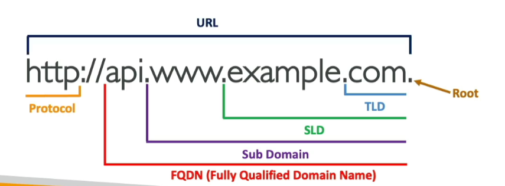

## How DNS Works

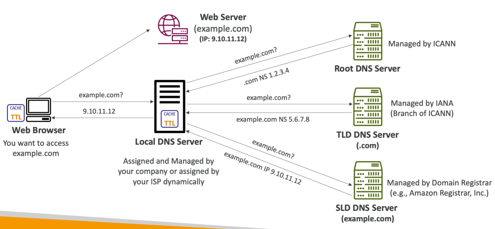

* Local DNS Server asks Root DNS Server whether it knows the IP for example.com
    * Local DNS Server replies: idk, but I see that it is a ".com". You can ask 1.2.3.4 about this
* Local DNS asks TLD DNS Server whether it knows the IP for example.com
    * (similar answer as Root DNS Server)
* Local DNS asks Domain Registrar and gets the IP, and then replies to web browser

# Route 53

## Overview

* A highly available, scalable, fully managed and Authoritative DNS
    * authortative = the customer (you) can update the DNS Records
* Route 53 is also a Domain Registrar
* Ability to check the health of your resource
* The only AWS service which provides 100% availability SLA
* Why Route 53? 53 is a reference to the traditional DNS port

## Records
* How you want to route traffic for a domain
* Each record contains:
    * Domain/subdomain name - eg. example.com
    * Record Type - eg. A or AAAA
    * Value - eg. 12.34.56.78
    * Routing Policy - how Route 53 responds to queries
    * TTL - amount of time the record cached at DNS Resolvers
* Route 53 supports the following DNS record types:
    * (must know) A/AAAA/CNAME/NS
    * (advanced) CAA/DS/MX/NAPTR/PTR/SOA/TXT/SPF/SRV

### Record Types
* A - maps a hostname to a IPv4
* AAAA - maps a hostname to IPv6
* CNAME - maps hostname to another hostname 
    * The target is a domain name which must have an A or AAAA recrod
    * Can't create a CNAME record for the top node of a DNS namespace (Zone Apex)
    * For example, you cannot create for `example.com`, but can create for `www.example.com`
* NS - Name Servers for the hosted zone
    * Control how traffic is routed for a domain

## Hosted Zone
* A container for records that define how to route traffic to a domain and its subdomain
* Public Hosted Zones - contain records that specify how to route traffic on the Internet (public domain names)
* Private Hosted Zones - contain records that specify how to route traffic with one or more VPCs (private domain names); for private companies
* You pay $0.5 per month per hosted zone

### Public vs Private Hosted Zones

* private - queries by inside VPC
* public - queries by anyone

## TTL

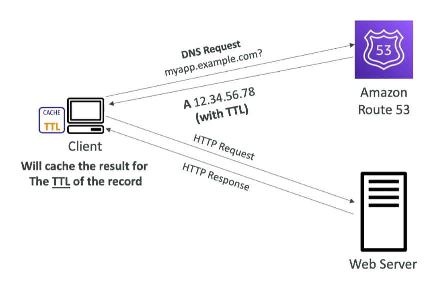

* High TTL - (eg. 24 hr)
    * Less traffic on route 53
    * possibly outdated records
* Low TTL - (eg. 60 sec)
    * More traffic on route 53 ($$)
    * Records are outdated for less time
    * easy to change records
* Except for Alias records, TTL is mandatory for each DNS record

## CNAME vs Alias
* AWS Resources (Load Balancer, CloudFront) expose an AWS hostname:
    * 1234.us-eat-2.elb.amazonaws.com and you want to apply `myapp.mydomain.com`
* CNAME:
    * points a hostname to any other hostname (app.mydomain.com --> bla.anything.com)
    * **ONLY FOR NON ROOT DOMAIN (mydomain.com)**
        * note that `blah.mydomain.com` is NOT root domain
* Alias (AWS-specific functionality)
    * points a hostname to an AWS Resource (app.mydomain.com --> bla.amazonaws.com)
    * **WORKS FOR ROOT DOMAIN and NON ROOT DOMAIN (aka mydomain.com)**
    * Free of Charge
    * Native Health Check

### Alias Records

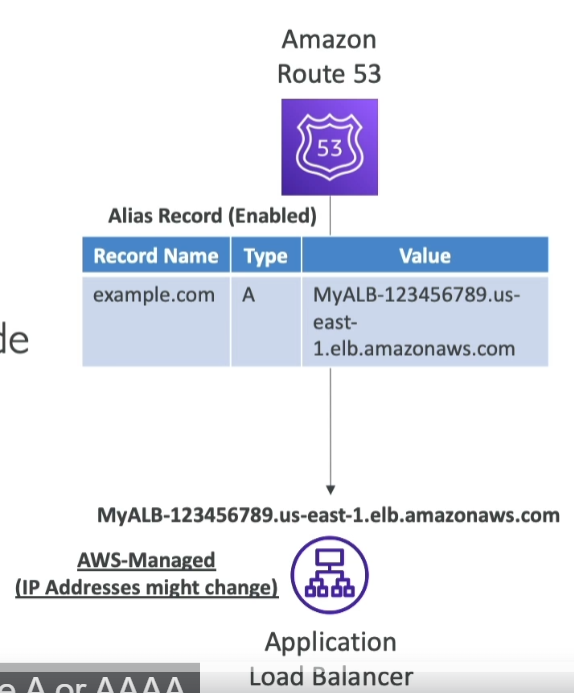

* Maps a hostname to an AWS resource
* An extension to DNS functionality
* Automatically recognizes changes in the resource's IP addresses
* Unlike CNAME, it can be used for the top node of a DNS name space (Zone Apex; which means root domain), eg: example.com
* Alias Record is always of type A/AAAA for AWS resources (IPv4, IPv6)
* You cannot set the TTL

### Alias Records Targets
* Elastic Load Balancers
* CloudFront Distributions
* API Gateway
* Elastic beanstalk environments
* S3 websites
* VPC Interface Endpoints
* Global Accelerator accelerator
* Route 53 record in the same hosted zone
* **You cannot set an ALIAS record for an EC2 DNS name**

## Routing Policy
* Define how Route 53 responds to DNS queries
* Don't get confused by the word "Routing"
    * it's not the same as Load Balancer routing, which routes the traffic
    * DNS does not route any traffic, it only responds to the DNS queries
* Route 53 supports the following routing policies:
    * Simple
    * Weighted
    * Latency
    * Geolocation
    * Multi-Value Answer
    * Geo proximity

### Simple
* Typically, route traffic to a single resource
* Can specify multiple values in the same record
    * If do this, a random one is chosen by the **client** (at the moment of querying the url, meaning when you refresh, it might jump to the next value (from the multi-value answer))
* When alias enabled, specify only one AWS resource
* Can't be associated with Health Checks

### Weighted

* Control the % of the requests that go to each specific resource
* Assign each record a relative weight
    * weights don't need to sum up to 100
    * traffic(%) = `weight for a specified record / sum of all weights for all records`
* DNS records must have the same name and type
* Can be associated with health checks
* Use cases: load balance between regions, testing new applications
* Assign a weight of 0 to stop sending traffic to a resource
* If all weights are 0, all records will be returned equally

### Latency Based
* redirected to the resource that has the least latency close to us
* super helpful when latency for users is a priority 
* latency is based on traffic between users and AWS regions
* Germany users may be directed to the US (if that's the lowest latency)
* Can be associated with health check (has a failover capability)

#### Health Checks
* HTTP Health Checks are only for public resources
* Health Check => Automated DNS Failover. There are 3 types:
    1. Health Checks that minotr an endpoint (application, server, other AWS resource)
    2. Health Checks that monitor other health checks (calculated health checks)
    3. Health Checks that monitor CloudWatch Alarams (full control!!) - eg. throttles of DynamoDB alarms on RDS custom metrics 
* Health checks are integrated with CW metrics

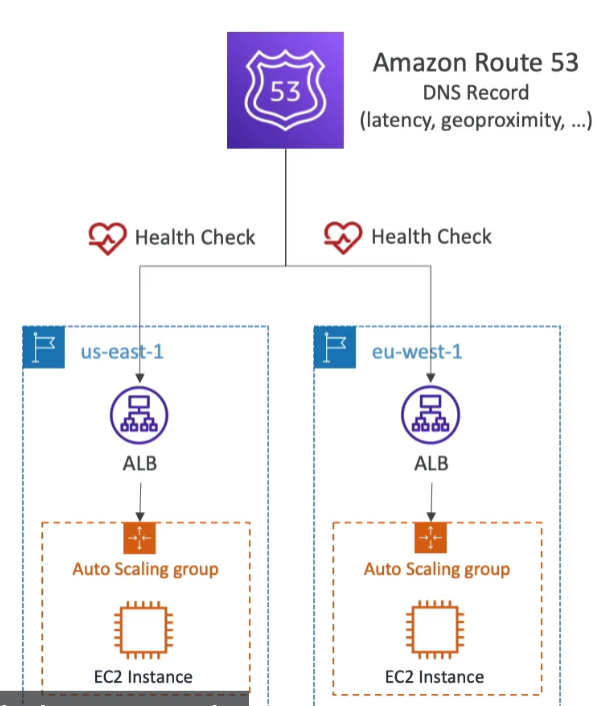

**Monitor an Endpoint**
* About 15 global health checkers will check the endpoint health
    * Healthy/unhealthy threshold - 3 (default)
    * internal - 30 sec (can set to 10 sec - higher cost)
    * supported protocol - HTTP, HTTPS and TCP
    * If > 18% of health checkers report the endpoint is healthy, Route 53 considers it Healthy. Otherwise, it is unhealthy
    * Ability to choose which locations you want Route 53 to use
* Health checks pass only when the endpoint response with 2XX and 3XX status codes
* Health Checks can be setup to pass/fail based on the text in the first 5120 bytes of the response.
* Configure your router/firewall to allow incoming requests from Route53 Health Checkers

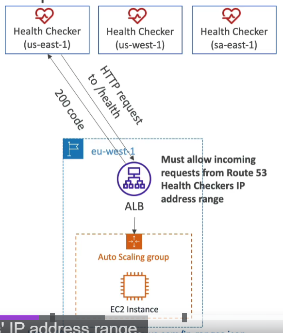

**Calculated Health Checks**
* combine the result of multiple health checks into a single health
* you can use OR, and or NOT
* can monitor up to 256 child health checks
* specify how many of the health checks need to pass to make the parent pass
* Usage: perform maintence to your website without causing all health checks to fail. In other words, I only need to guarantee n number of alive nodes. I'm okay with a few down, either due to SLA or maintenance. Also remember that this will route based on latency, so the end user will not be affected.

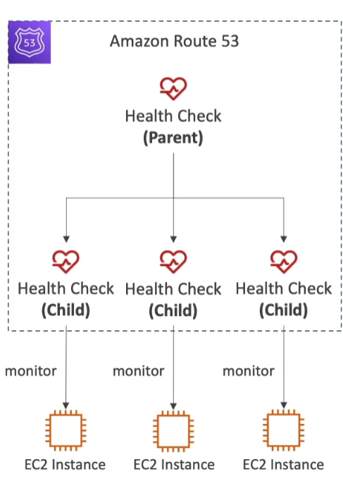

**Private Hosted Zone**
* Route 53 health checkers are outside the VPC
* They can't access private endpoints (private VPC or on-premises resource)
* You can create a CloudWatch Metric and associate a Cloudwatch Alarm, then create a health check that checks the alarm itself
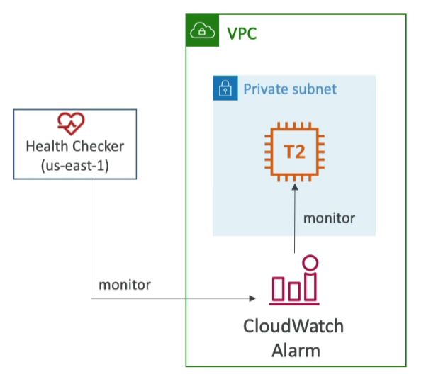

### Failover (active-passive)

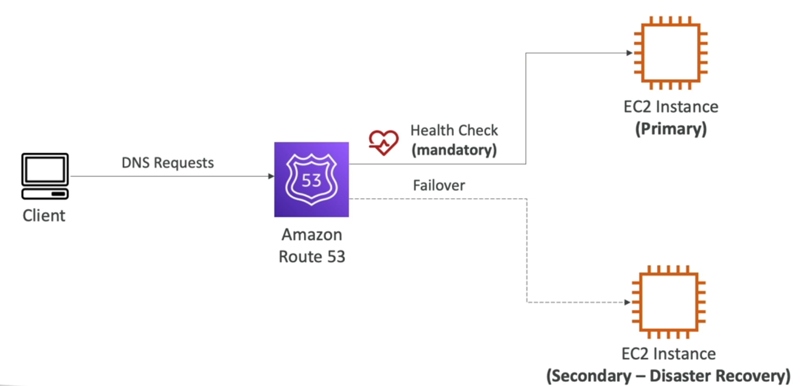

### GeoLocation

* Different from latency-based!
* This routing is based on user location
* specify locaiton by continent, country or by US state (if there's overlapping, the most precise location is selected)
* Should create a default record (in case there's no match on location)
* use case: localization, restrict content distribution, load balancing...
* can be associated with health checks

### Geoproximity

* Route traffic to your resources based on the geophic location of users and resources
* Ability to shift traffic to resource based on the defined bias
* To change the size of the geographic region, specify bias values:
    * To expand (1 to 99) - more traffic to the resource
    * To shrink (-1 to -99) - less traffic to the resource

* Resources can be:
    * AWS resource (specify AWS region)
    * Non-AWS resource (specify Latitude and Longitude)

* You must use Route 53 Traffic Flow (advanced) to use this feature

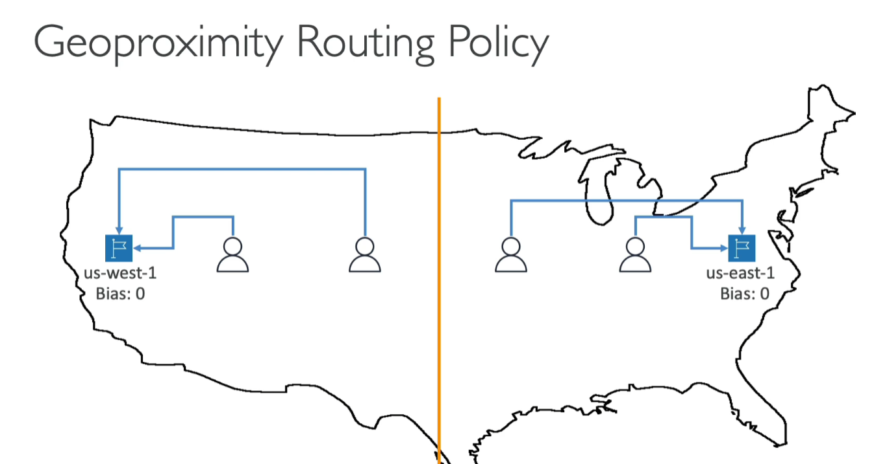

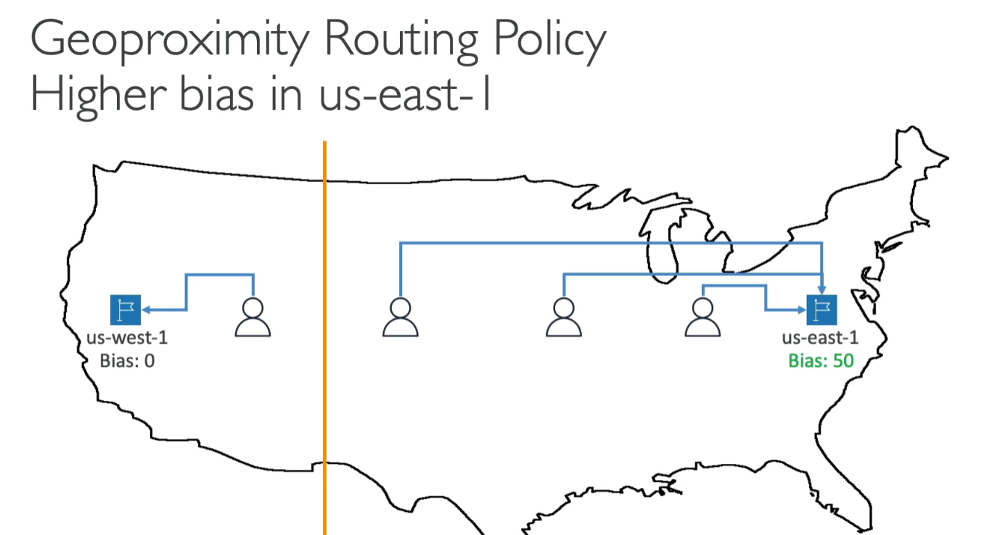

### Traffic Flow
* Simplify the process of creating and maintaining records in large and complex configurations
* Visual editor to manage complex routing decision trees
* Configurations can be saved as **Traffic Flow Policy**
    * can be applied to different Route 53 Hosted Zones (different domain names)
    * Supports versioning

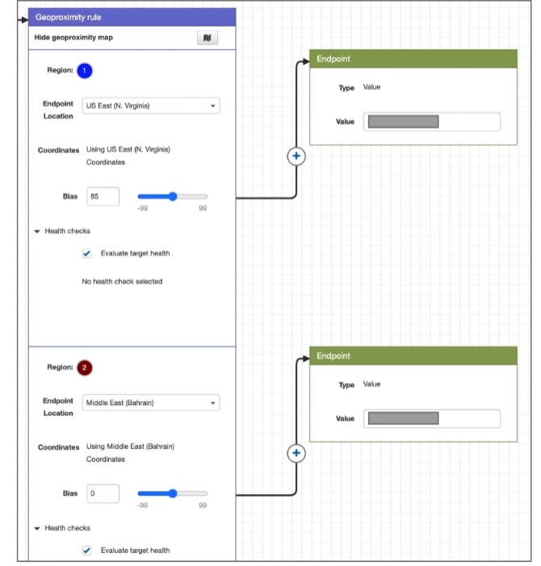

### IP based Routing
* Routing is based on client's IP addresses
* You provide a list of CIDRs for your clients and the corresponding endpoints/locations (user-IP-to-endpoint mappings)
* Use cases: Optimize performance, reduce network costs...
* Example: route end users from a particular ISP to a specific endpoint

### MultiVAlue
* Use when routing traffic to multiple resources
* Route 53 return multiple values/resources
* can be associated with health checks (return only values for healthy resources)
* Up to 8 healthy records are returned for each multi-value query
* Multi-value is not a substitude for having an ELB
