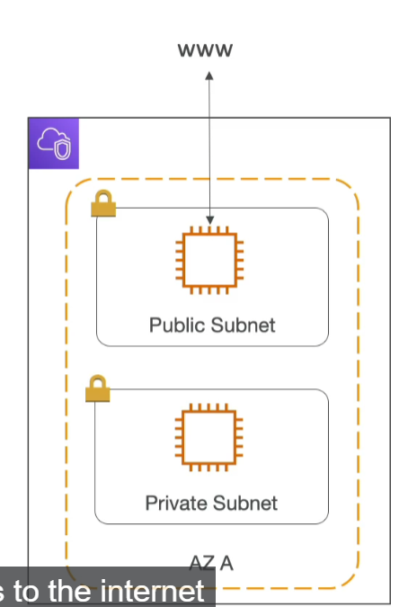
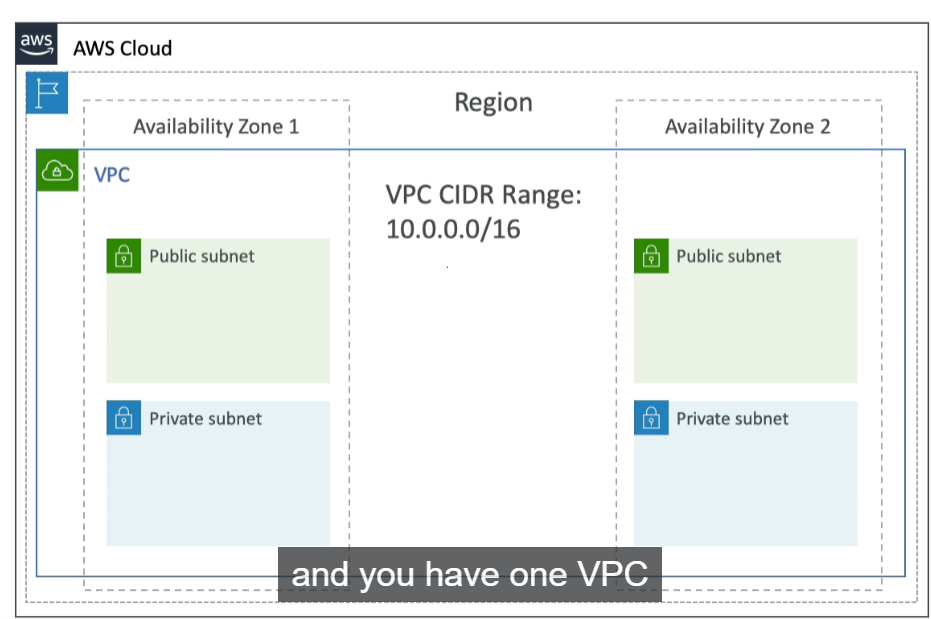
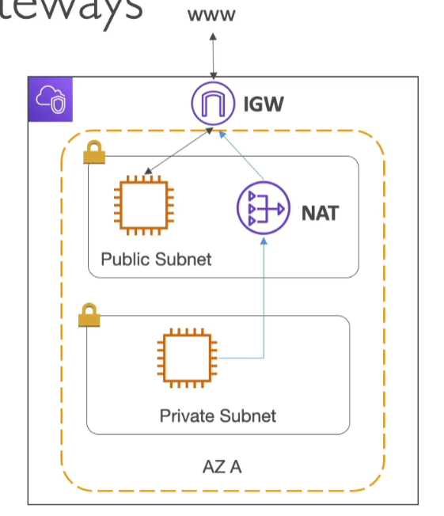
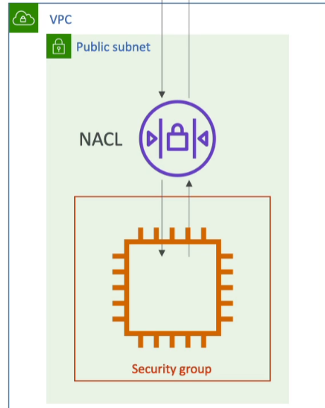
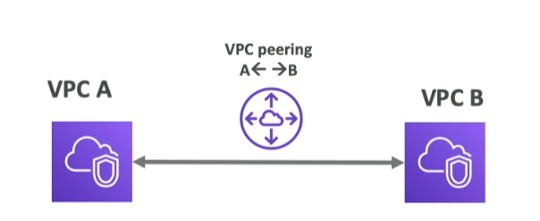
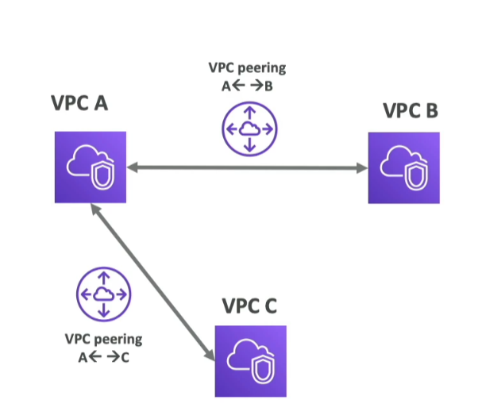

# VPC - Virtual Private Cloud

* What you need to know:
    * VPC, Subnets, Internet Gateways & NAT gateways
    * Security Groups, Network ACL (NACL), VPC Flow Logs
    * VPC Peering, VPC Endpoints
    * Site to Site & Direct Connect

## VPC & Subnets Primer
* VPC: private network to deploy your resources (regional resource)
* Subnets: allow you to partition your network inside your VPC (Availability Zone resource)
* Public Subnet: a subnet that is accessible from the internet
* Private Subnet: a subnet that is NOT accessible from the internet
    
* To define access to the internet and between subnets, we use **Route Tables**

* 1 private subnet per AZ
* 1 public subnet per region - called **Default VPC**

## Internet Gateway & NAT (network address translation) Gateways

* Internet Gateways:
    * Helps our VPC instances connect with the internet
    * Public Subnets have a route to the internet gateway
* NAT Gateways (AWS-managed) & NAT instances (self-managed):
    * This allows your instances in your **private** subnets to access the internet while remaining private
    * How does it do this?
        * Private subnet --> NAT --> IGW --> www

## Network ACL & Security Groups

* NACL (Network ACL(Access control list))
    * a firewall which controls traffic from and to subnet
    * can have ALLOW and DENY rules
    * Attached at the **Subnet** level
    * Rules only include IP addresses
* Security Groups
    * A firewall that controls traffic to and from an ENI/an EC2 instance
    * Can have only ALLOW rules
    * Rules include IP addresses and ohter security groups

## VPC (virtual private cloud) Flow log
* Capture information about IP traffic going into your interfaces:
    * VPC flow logs
    * Subnet Flow logs
    * Elastic Network INterface Flow logs
* Helps to monitor & trouble shoot connectivity issues, eg:
    * Subnets to internet
    * Subnets to subnets
    * internet to subnets
* CAptures network information from AWS managed interfaces too: ELB< ElasticCache
* VPC flow logs data can go to S3, Cloud Watch logs and Kinesis Data firehose

## VPC Peering
* Connect two VPC, privately using AWS' network
* Make them behave as if they were in the same network
* Must not have overlapping CIDR (IP address range); I think this is so the network needs to know where to go. 

* VPC peering connection is **not transitive** (must be established for each VPC that need to communicate with one another)
    * for example: in image below, VPC B and C cannot communicate via A, need to create their own VPC peering (bewteen B and C) for those to communicate

## VPC Endpoints
* Endpoints allow you to connect to AWS Services using a private network instead of the public www network
* This gives you enhanced security and lower latency to access AWS services (without having to go via public network)
* Basically, whenever asked to connect to AWS via private network, you need **VPC endpoint**
* S3 and DynamoDB are the only two services that have a VPC Gateway Endpoint (remember it), all the other ones have an Interface endpoint (powered by Private Link - means a private IP).

## Site to Site VPN VS Direct Connect
* Site to Site VPN
    * Connect an on-premises VPN to AWS
    * the connection is automatically encrypted
    * goes over the **public** internet
* Direct Connect (DX)
    * Establish a **physical** connection between on-premises and AWS
    * connection is **private**, secure and fast
    * goes over **private** network
    * takes at least a month to establish (cuz takes time to set-up direct connection)

## Closing Comments

* VPC: Virtual Private Cloud
* Subnets: Tied to an AZ, network partition of the VPC
* Internet Gateway: at the VPC level, provide Internet Access
* NAT Gateway/Instances: give internet access to private subnets
* NACL (Network ACL): Stateless, subnet rules for inbound and outbound
* Security Group: Stateful, operate at the EC2 instance level or ENI
* VPC Peering: Connect 2 VPC with non overlapping IP range, non-transitive
* VPC Endpoints: Provide private access to AWS Service within VPC
* VPC Flow Log: network traffic logs

## 3-Tier Architecture

(SKIPPED)

## 