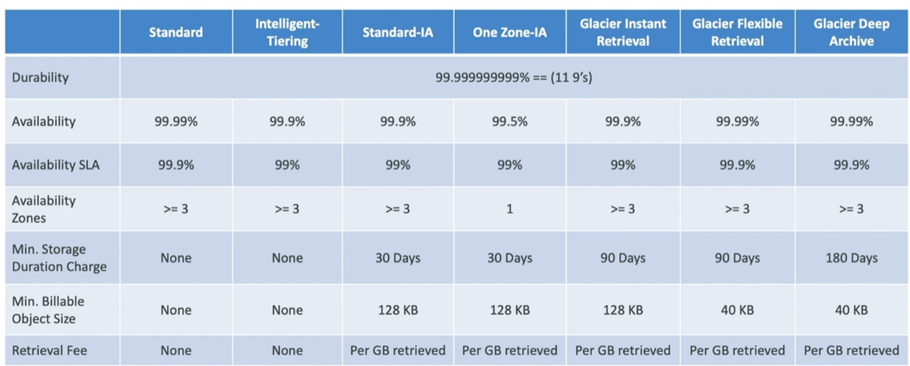

# S3

## Section Introduction

* One of the main building blocks of AWS
* advertised as "infinitely scaling" storage
* Many websites use Amazon S3 as a backbone
* Many AWS Services use Amazon S3 as an integration as well

### S3 Use Cases
* Backup and Storage
* Disaster Recovery
* Archive
* Hybrid Cloud Storage
* Media Hosting
* Data Lakes & Big Data Analytics
* Software Delivery
* Static Website

* NasDaq stores 7 years of data in S3 Glacier

### Buckets
* S3 allows people to store "Objects" (files) in "Buckets" (directories)
* Buckets must have a globally unique name (across all regions all accounts)
* Buckets are defined at the region level
* S3 looks like a global service, but buckets are created in a region
* Naming Convention
    * no uppercase, no underscore
    * 3-63 characters long
    * Not an IP
    * Must start with lower case, or number
    * Must not Start with the prefix `xn--` nor `-s3alias`

### Objects
* Objects (files) have a key
* Key is the FULL PATH:
    * s3://my-bucket/my_file.txt
    * s3://my-buckets/folder1/folder2/my_file.text
* Object values are the content of the body
    * Max Object size = 5TB (5000GB)
    * if uploading more than 5GB, need use "multi-part upload"

* Metadata (list of key/value pairs, system or user metadata)
* Tags (Unicode key/value pair - up to 10) - useful for security/lifecycle
* Version ID (if versioning is enabled)

## Security

* User-Based
    * IAM Policies - which API calls should be allowed for a specific user from IAM
* Resource-Based
    * Bucket Policies - bucket wide rules from the S3 console - allows cross account
    * Object Access Control List (ACL) - finer grain (can be disabled)
    * Bucket Access Control List (ACL) - less common (can be disabled)
* Note: an IAM Principal can access an S3 if:
    * User IAM Permissions ALLOW it **OR**the resource policy ALLOWS it
    * **AND** there's no explicit DENY
* Encryption
    * encrypt objects in S3 using encryption keys

### S3 Bucket Policies
* JSON based policies
    * Resources: buckets and objects
    * Effect: Allow/Deny
    * Actions: Set of API to Allow or Deny
    * Principal: the account or user to apply the policy to
* Use S3 bucket for policy to:
    * Grant public access to the bucket
    * Force objects to be encrypted at uploda
    * Grant access  to another account (cross account)

### Bucket Settings for Block Public Access

* These settings were created to prevent company data leaks
* if you know your bucket should never be public, leave these on.
* can be set at account level

## Static Website Hosting
* S3 can host static websites and have them accessible on the Internet
* The website URL will be (depending on the region)
    * http://bucket-name.s3-website-aws-region.amazonaws.com
    * Or, http://bucket-name.s3-website.aws-region.amazonaws.com (the only diff is s3-website"."aws")

* If you get a 403 forbidden error, make sure the bucket policy allows public reads

## Versioning

* you can version your files in Amazon S3
* it is enabled at the bucket level
* same key overwrite will change the 'version': 1,2,3...
* it is best practice to version your buckets
    * protect against unintended deletes (ability to restore a version)
    * easy roll back to previous version
* notes:
    * any file that is not versioned prior to enabling versioning will have version"null"

## Replication (CRR & SRR)

* CRR = cross region replication
* SRR = same region replication
* Must enable versioning in source and destination buckets
* Buckets can be in different AWS accounts
* copying is asynchronous
* must give proper IAM permissions to S3
* Use cases:
    * CRR - compliance, lower latency access, replication across acounts
    * SRR - log aggregation, live replication between product and test accounts

### More Info
* After you enable replication, only new objects are replicated
* Optionally, you can replicate existing objects using **S3 Batch Replication**
    * replicates existing objects and objects that failed replication

* For DELETE operations
    * can replicate delete markers from source to target (optional setting)
    * Deletions with a version ID are not replicated (to avoid malicious deletes)

* There is no "chaining" of replication
    * if bucket 1 has replication into bucket 2, which has replication into bucket 3
    * Then objects created in bucket 1 are not replicated to bucket 3

## S3 storage classes overview
* classes
    * Amazon S3 Standard - General Purpose
    * Amazon S3 Standard - Infrequent Access (IA)
    * Amazon S3 One Zone - Infrequent Access
    * Amazon S3 Glacier Instant Retrieval
    * Amazon S3 Glacier Flexible Retrieval
    * Amazon S3 Glacier Deep Archive
    * Amazon S3 Intelligent Tiering

* Can move between classes manually or using S3 lifecycle configurations

### Durability and Availability
* Durability 
    * High durability (99.999999999%, 11 9's) of objects across multiple AZ
    * If you store 10,000,000 objects with Amazon S3, you can on average expect to incur a loss of a single object once every 10,000 years
    * same for all storage classes

* Availability
    * Measures how readily available a service is
    * Varies depending on storage class
    * Example: S3 standard has 99.99% availability = not available 53 minutes a year (basically acceptable downtime given a certain period of time)

### S3 standard - general purpose
* 99.99% availability
* used for frequently accessed data
* low latency and high throughput
* sustain 2 concurrent facility failures
* Use cases: Big data analytics, mobile & gaming applications, content distribution...

### S3 Storage classes - infrequenty access
* for data that is less frequently accessed, but requires rapid access when needed
* lower cost than S3
* Amazon S3 standard-infrequent access (S3 Standard-IA)
    * 99.9% availability
    * use cases: disaster recovery, backups
* Amazon S3 One zone - infrequent access (S3 One Zone-IA)
    * High durability (99.99...%) in a single AZ, data lost when AZ is destroyed
    * 99.5% Availability
    * Use cases: storing secondary backup copies of on-premise data, or data you can recreate

### Amazon S3 Glacier Storage Classes
* low cost object storage meant for archiving/backup
* pricing: price for storage + object retrieval cost
* Amazon S3 Glacier Instant Retrieval
    * Millisecond retrieval, great for data accessed once a quarter
    * minimumstorage duration of 90 days
* Amazon S3 Glacier Flexible Retrieval (formerly amazon s3 glacier)
    * expedited (1 to 5 hours), standard (3 to 5 hours), bulk (5 to 12 hours) - free
    * Minimum storage duration of 90 days
* Amazon S3 Glacier Deep Archive - for long term storage:
    * Standard (12 hours), Bulk (48 hours)
    * Minimum storage of 180 days
* S3 Intelligent Tiering 
    * Small monthly monitoring and auto-tiering free
    * Moves objects automatically between access tiers based on usage
    * there are no retrieval charges in S3 intelligent-Tiering

    * Frequent access tier(automatic): default tier
    * Infrequent access tier (automatic): objects not accessed for 30 days
    * Archive Instant access tier (automatic): objects not accessed for 90 days
    * Archive Access Tier (optional): configurable from 90d to 700+ d
    * Deep Archive Access tier (optional): configurable from 180d to 700+ d

    
    