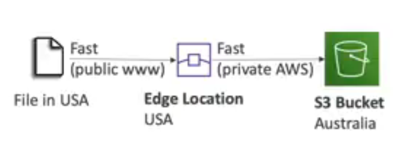
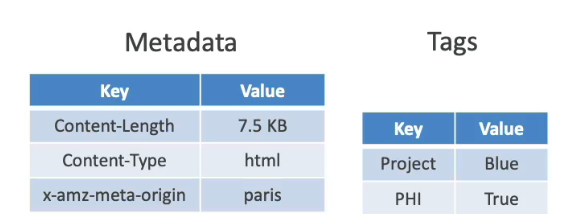
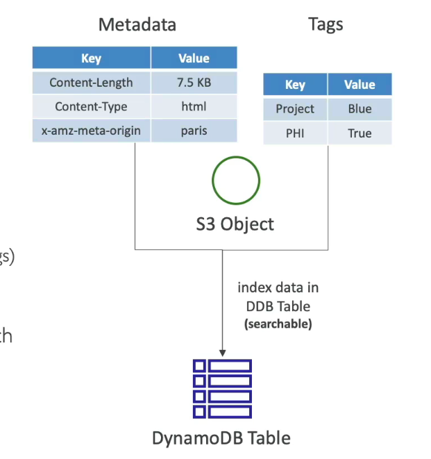

# Advanced S3

## Moving between Storage Class

* You can transition between storage classes
* For infrequently accessed object, move them to Standard IA
* For archive objects that you don't need fast access to, move them to Glacier or Glacier Deep Archive
* Moving objects can be automated using a Lifecycle Rules

## Lifecycle Rules

* Transition Actions - configure objects to transition to another storage class
    * eg. Move objects to Standard IA class 60 days after creation
    * eg. Move to Glacier for achiving after 6 months
* Expiration Actions - configure objects to expire (delete) after some time
    * Access log files can be set to delete after a 365 days
    * Can be used to delete old versions of files (if versioning is enabled) 
    * Can be used to delete incomplete Multi-Part uploads
* Rules can be created for a certain prefix (example: s3://mybucket/mp3/*)
* Rules can be created for a certan objects Tag (example: Department:Finance)

## Scenario 1
* Your application on EC2 creates images thumbnails after profile photos are uploaded to Amazon S3. These thumbnails can be easily recreated ,and only need to be kept for 60 days. The source images should be able to be immediately retrieved for these 60 days, and afterwards, the user can wait up to 6 hours. How would you design this?

* Solution
    * S3 Source images can be on **standard**, with a lifecycle configuration to transition them to **glacier** after 60 days
    * S3 thumbnails can be on **one-zone IA**, with a lifecycle configuration to expire them (delete them) after 60 days

## Scenario 2
* A rule in your company states that you should be able to recover your deleted S3 objects immediately for 30 days, although this may happen rarely. After this time, and for up to 365 days, deleted objects should be recoverable within 48 days.

* Solution
    * **Enable S3 Versioning** in order to have object versions, so that 'deleted objects' are in fact hidden by a 'delete marker' and can be recovered
    * Transition the 'noncurrent versions' of the object to **Standard IA** (first 30 days)
    * Transition afterwards the 'non concurrent versions' to Glacier Deep Archive (up to 365 days)

## S3 Analytics

* Help you decide when to transition objects to the right storage class
* Recommendations for **Standard** and **standard ia**
    * Does NOT work fro one-zone IA and glacier
* Report is updated daily
* 24 to 48 hours to start seeing data analysis

## Event Notifications

* eg: S3:ObjectCreated, S3:ObjectRemoved, S3:ObjectRestore, S3: Replication...
* Object name filtering possible (*.jpg)
* Use case: generate thumbnails of images uploaded to S3
* Can create as many S3 Events as desired
* S3 event notifications typically deliver events in seconds but can sometiems take a minute or longer

### IAM Permissions

* This is probably how your architecture will look like.
* Note that you will need to configure SNS/SQS/Lambda access/Resource policy to allow S3 to write to them

### S3 Events notifications with Amazon EventBridge

* Another integration method is via **Amazon EventBridge**.
* It also provides these functionalities:
    * **Advanced Filtering** options with JSON rules (metadata, object size, name...)
    * **Multiple Destinations** - ex: step functions, kinesis streams/firehose
    * **EventBridge Capabilities** - Archive, Replay Events, Reliable Delivery

### Baseline Performance

* Amazon S3 automatically scales to high request rates, latency 100-200 ms
* Your application can achieve at least 3500 PUT/COPY/POST/DELETE or 5500 GET/HEAD requests per second **per prefix** in a bucket.
* There are no lmits to the number of prefixes in a bucket
* Example (object path => prefix)
    * bucket/folder/sub1/file => /folder1/sub1/

* If you spread reads across all prefixes eventually, you can achieve x(number of prefixes) requests per second for GET and HEAD

#### Multi-Part upload
    * recommended for files > 100 MB; must use for files > 5GB
    * Can help parallelize uploads (speed up transfers)

#### S3 Transfer Acceleration
    * Increase transfer speed by transferring file to an AWS edge location which will forward the data to the S3 bucket in the target region
    * Compatible with multi-part upload

#### S3 Byte-Range Fetches
* Parallelize GETs by requesting specific byte ranges
* Better resilience in case of failures
* Can by used to speed up downloads
* Can be used to retrieve only partial data (for example the head of a file)

### S3 User-Defined Object Metadata & S3 Object Tags
* S3 User-Defined Object Metadata
    * When uploading an object, you can also assign metadata
    * Name-value (key-value) pairs
    * User-defined metadata names must begin with "x-amz-meta"
    * Amazon S3 stores user-defined metadata keys in lowercase
    * Metadata can be retrieved while retrieving the object
* Object Tags
    * Key-value pairs for objects in Amazon s3
    * useful for fine-grained permissions (only access specific objects with specific tags)
    * Userful for analytics purposes (using S3 analytics to group by tags)

 

* **You cannot search the object metadata or object tags**
* Instead, you must use an external DB as a search index such as DynamoDB. (common exam question)

 
