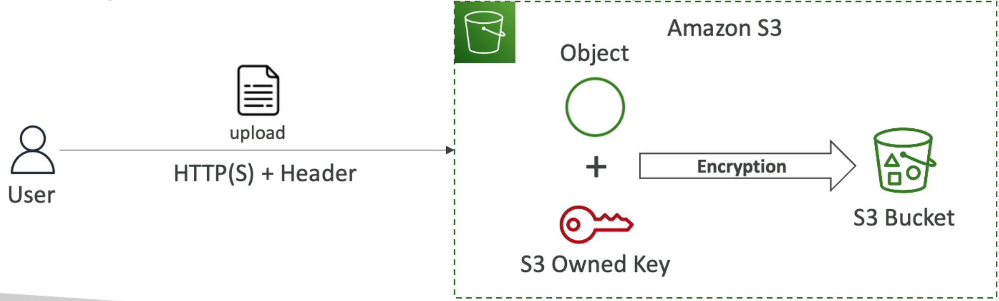
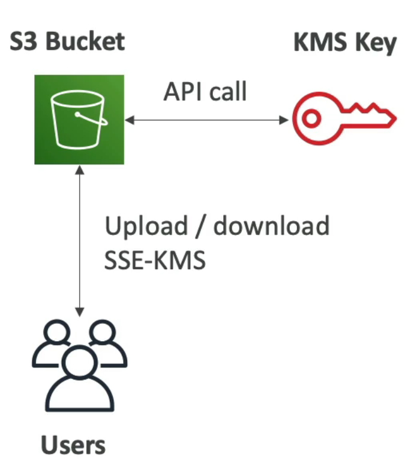
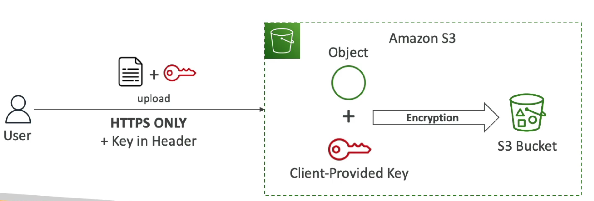
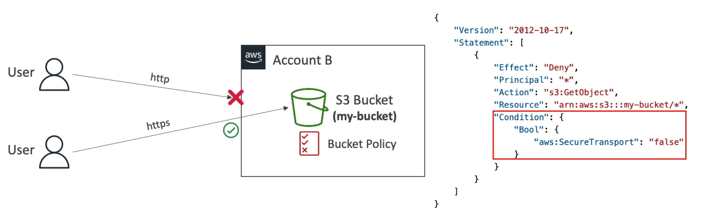

# S3 Encryption

## Object Encryption

* You can encrypt object in S3 buckets using one of 4 methods
    * Server-Side Encryption (SSE)
        1. Server-Side Encryption with Amazon S3-Managed Keys (SSE-S3) - **enabled by default**
        2. Server-side Encryption with KMS Keys stored in AWS KMS (SSE-KMS)
            * Leverage AWS Key Management Service (AWS KMS) to manage encryption keys
        3. Server-side Encryption with Customer-Provided Keys (SSE-C)
            * When you want to manage your own encryption keys
    * Client-side encryption

### Details

1. Server-Side Encryption with Amazon S3-Managed Keys (SSE-S3)
    * Encryption using keys handled, managed, and owned by AWS
    * Object is encrypted server-side
    * Encryption type is AES-256
    * Must set header "x-amz-server-side-encryption": "AES256"
    * Enabled by defautl for new buckets & new objects

2. SSE-KMS 
* encryption using keys handled and managed by AWS KMS (Key management service)
* KMS advantages: user control + audit key usage using CloudTrail
* Object is encrypted server side
* Must set header "x-amz-server-side-encryption": "aws:kms"

* Limitations
    * If you use SSE-KMS, you may be impacted by the KMS limits
    * When you upload, it calls the **GenerateDataKey** KMS API
    * When you download, it calls the **Decrypt** KMS API
    * Count torwards the KMS quota per second 
    * you can request a quota increase using the Service Quotas Console

3. SSE-C
* Server-side encryption using keys fully managed by customer outside of AWS
* AWS S3 does **NOT** store the encryption key you provide
* **HTTPS must be used**
* Encryption key must provided in HTTP headers, for every HTTP Request made

4. Client side encryption
* Use client libraries such as Amazon S3 Client-Side Encryption Library
* Clients must encrypt data themsevles before sending to Amazon S3
* Clients must decrypt data themsevles when retrieving from Amazon S3
* Customer fully manages the keys and encryption cycle

### Encryption in Transit (SSL/TLS)
* Encryption in flight is also called SSL/TLS
* Amazon S3 exposes two endpoints:
    * HTTP endpoint - non encrypted
    * HTTPS endpoint - encryption in flight
* HTTPS is recommended
* HTTPS is mandatory for SSE-C
* Most clients would use the HTTPS endpoint by default

### Force Encryption in Transit aws:SecureTransport

### DSSE-KMS

* a new encryption option is available, named DSSE-KMS and released in June 2023.
* DSSE-KMS is just "double encryption based on KMS".

