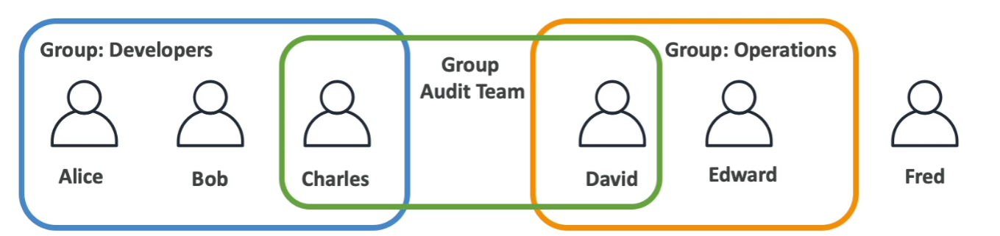
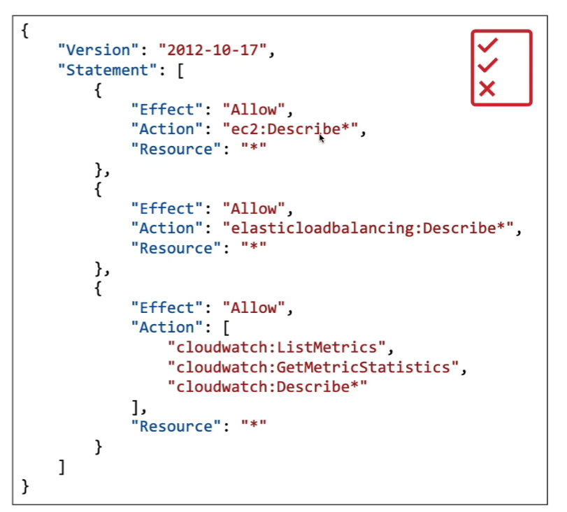

# IAM

## Users & Groups

* IAM = Identity and Access Management (Global Service)
* **Root account** created by default, shouldn't be used or shared
* **Users** are people within your organization, and can be grouped.
* **Groups** can only contain users; not other groups
* Users do not have to belong to a group, and user can belong to multiple groups

## Permissions
* **Users or Groups** can be assigned JSON documents called **policies**
* These policies define the **permissions** of the user
* In AWS, you apply the **least priviledge principal**; don't give more permissions that a user needs

