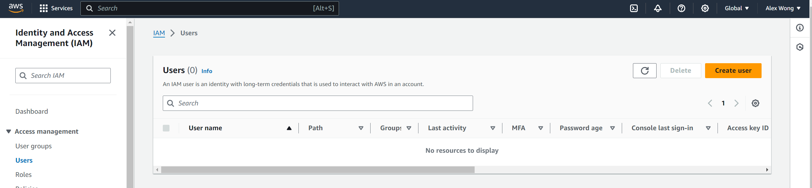
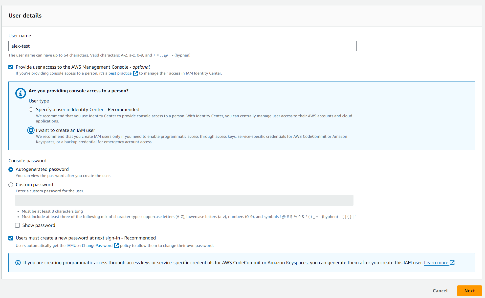
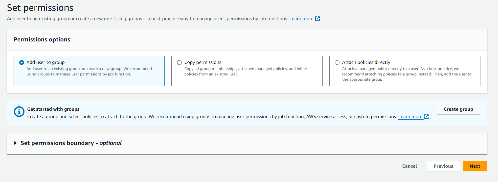
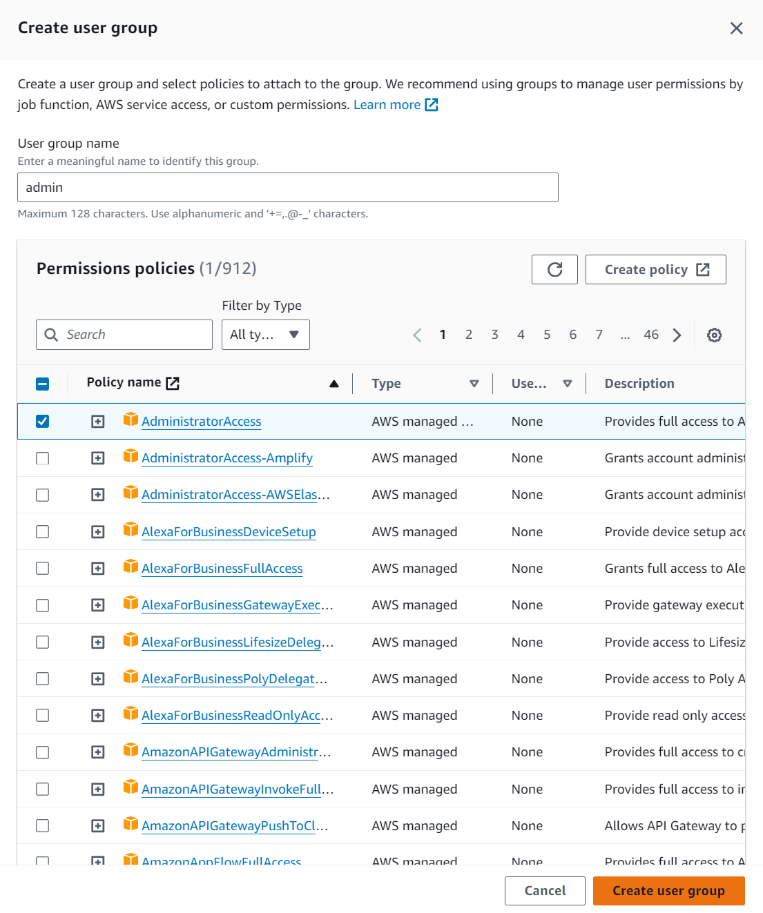
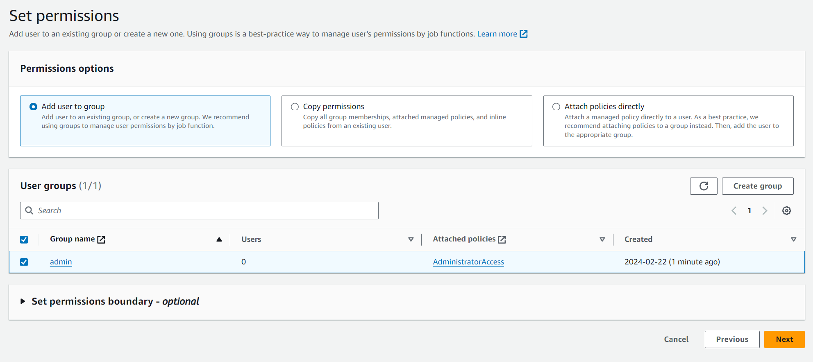
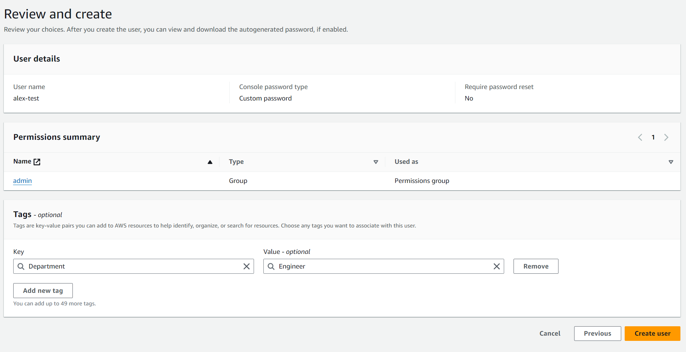
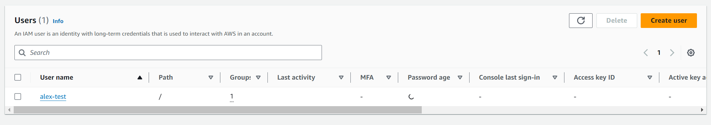
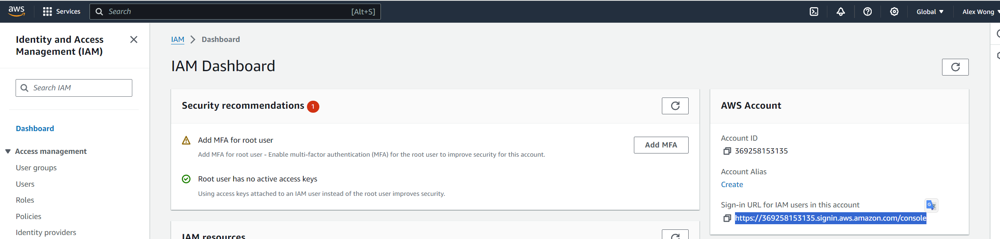
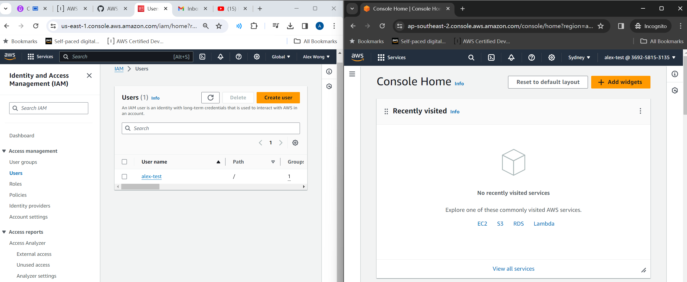

# IAM

## Users & Groups

* IAM = Identity and Access Management (Global Service)
* **Root account** created by default, shouldn't be used or shared
* **Users** are people within your organization, and can be grouped.
* **Groups** can only contain users; not other groups
* Users do not have to belong to a group, and user can belong to multiple groups

## Permissions
* **Users or Groups** can be assigned JSON documents called **policies**
* These policies define the **permissions** of the user
* In AWS, you apply the **least priviledge principal**; don't give more permissions that a user needs

## Hands On

* IAM -> Users 
    * Notice how the region for IAM is 'global'

* Click "Create User"
    * Why need to create user?
        * Because right now, you are using Root User; which is not best practice
        

* Click "Next"

* Click "Create group"
* Select Administrator Access

* IAM -> Dashboard -> AWS Account -> Sign-in URL for IAM users in this account -> Open this in incognito
    * Set alias for convenience
    * Reason for this: so we have 2 screens to work with

## IAM Policies

