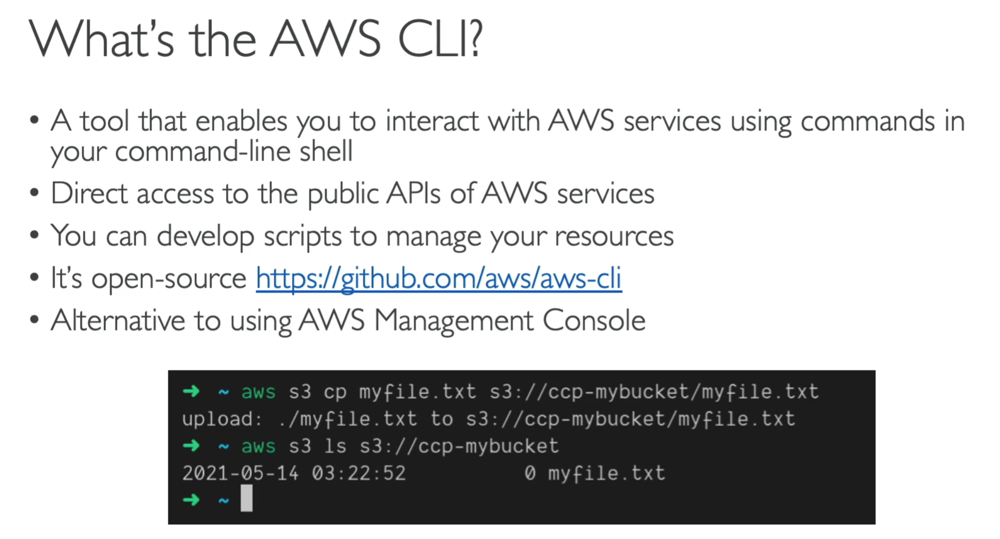

# IAM

## Users & Groups

* IAM = Identity and Access Management (Global Service)
* **Root account** created by default, shouldn't be used or shared
* **Users** are people within your organization, and can be grouped.
* **Groups** can only contain users; not other groups
* Users do not have to belong to a group, and user can belong to multiple groups

## Permissions
* **Users or Groups** can be assigned JSON documents called **policies**
* These policies define the **permissions** of the user
* In AWS, you apply the **least priviledge principal**; don't give more permissions that a user needs

## Hands On

* IAM -> Users 
    * Notice how the region for IAM is 'global'

* Click "Create User"
    * Why need to create user?
        * Because right now, you are using Root User; which is not best practice
        

* Click "Next"

* Click "Create group"
* Select Administrator Access

* IAM -> Dashboard -> AWS Account -> Sign-in URL for IAM users in this account -> Open this in incognito
    * Set alias for convenience
    * Reason for this: so we have 2 screens to work with

## IAM Policies

* You can add policies to users directly, or add policies to groups and add users to the groups

## Password Policy

* AWS suports MFA (multi-factor account) as well
    * device options
        * Virtual MFA device (support multiple tokens on single device)
            * Google Authenticator (phone only)
            * Authy (multi-device)
        * Universal 2nd Factor (U2F) Security Key
            
            * Support for multiple root and IAM users using a single security key

        * Hardware Key Fob MFA Device
        * Hardware Key Fob MFA Device for AWS GovCloud (US)

* Hands On notes
    * IAM -> Access Managementt -> Account Settings -> Password Policy -> Edit

## AWS CLI

* Users -> <your user> -> security credential -> create access key
* `aws configure`
* cli permission is exact same as the console permissions (obviously)

## CloudShell (not avaialble in every region)

* shell icon on top right of nav bar
* basically cli but on the aws website
* all the files you create in cloud shell will stay..

## IAM roles

* Some AWS services need to perform actions on your behalf
* To do so, we assign permissions to them via IAM roles
* Common Roles:
    * EC2 Instance Roles
    * Lambda Function Roles
    * Roles for Cloudformation

* IAM -> Roles

# IAM Security Tools

# IAM Guidelines & Best Practices

* Don't use the root account except for AWS account setup
* One physical user = One AWS User
* Assign users to groups and assign permissions to groups
* Create a strong password policy
* Use and Enforce the use of Multi-Factor Authentication (MFA)
* Create and user ROles for giving permissions to AWS services
* Use Access Keys for Progarmmatic Access (CLI/SDK)
* Audit Permissions of your accoutn using IAM creditials report & IAM Access Advisor
* **Never share IAM Users & Access Keys!!**

# Shared Responsibility Model for IAM

# IAM Section Summary

* Users: mapped to a physical user, has a password for AWS console
* Groups: Contains users only
* Policies: JSON document that outlines permissions for users or groups
* Roles: for EC2 instances or AWS services
* Security: MFA + Password Policy
* AWS CLI: Manage your AWS services using the command-line
* AWS SDK: Manage your AWS services using a programming language
* Access Keys: Access AWS using the CLI or SDK
* Audit: IAM Credential REports & IAM Accesss Advisor

