# EC2 Fundamentals

## AWS Budget Setup

* Top right (user) -> Billing and Cost Management
* By default, your normal (non-root user) account won't have permissions for "Billing and Cost Management". To fix this:
    * In your root user account: Top right (user) -> Accounts -> Billing and Payments -> IAM and role access to Billing Information -> "Activate IAM access"


## Set up Budget

* In Billing page, "Budgets and Planning" -> Budgets -> "Create a Budget" -> "zero spend budget" -> create budget

## EC2 Basics


### EC2 User Data
* It is possible to bootstrap our instances using an EC2 User Data script
* Bootstrapping means launching commands when a machine starts
* The script is only run once at the instance first start
* EC2 user data is used to automate boot tasks, such as:
    * installing updates
    * installing software
    * downloading common files from the internet
    * anything you can think of
* The EC2 User Data Script runs with the root user

### EC2 Instance types


## Hands on

* We'll be launching our first virtual server using the AWS console
* We'll get a first high-level approach to the various parameters
* We'll see that our web server is launched using EC2 user data
* We'll learn how to start/stop.terminal our instance

### Notes

* EC2 -> launch instance
    * Key Pair (Login)
        * needed if you will ssh into the VM in the future
        * Create new key pair -> RSA -> .pem (mac/linux) or .ppk (windows version > 8)
    * Network
        * Tick "Allow HTTP traffic from the internet"
    *Advanced -> User Data
        * This is a script that will run when the OS starts (and only once (in the entire lifecycle))
        * Paste this:
```
#!/bin/bash
yum update -y
yum install -y httpd
systemctl start httpd
systemctl enable httpd
echo "<h1>Hello world from $(hostname -f)</h1>" > /var/www/html/index.html
```

* Find your newly created EC2 -> Networking -> Copy "Public IPv4 address" -> in a new tab, enter "http://{IPv4 address}"
    * Note: HTTP not HTTPS

* Stop/Turn off instance
    * Instance State -> Stop Instance -> Instance State -> Terminate Instance

## EC2 Instance Type Basics
* Overview
    * You can use different types of EC2 instances that are optimised for different use cases
    * AWS has the following naming convention: `m5.2xlarge`
        * `m` : instance class
        * `5` : generation (AWS improves them over time)
        * `2xlarge` : size within the instance class; basically the bigger the larger
* Types
    * General Purpose
        * Great divertiy of workloads, such as web servers or code repositories
        * In this course, we used t2.micro; which is a General Purpose EC2 instance
    * Compute Optimized
        * Great for compute-intensive tasks that require high performance processors:
            * Batch processing workloads
            * Media transcoding
            * High performance web servers
            * High performance computing (HPC)
            * Scientific Modeling & Machine Learning
            * Dedicated Gaming Servers
    * Memory Optimized
        * Fast performance for workloads that process large data sets in memory
        * Use cases:
            * High performance, relational/non-relational databases
            * Distributed web scale cache stores
            * In-memory databases optimized for BI (Business Intelligence)
            * Applications peforming real-time processing of big unstructurered data
    * Storage Optimized
        * Great for storage-intensive tasks that require high, sequential read and write access to large data set on local storage
        * Use cases:
            * High frequency online transaction processing (OLTP) systems
            * Relational & NoSQL databases
            * Cache for in-memory databses (eg. Redis)
            * Data warehousing applications
            * Distributed file systems

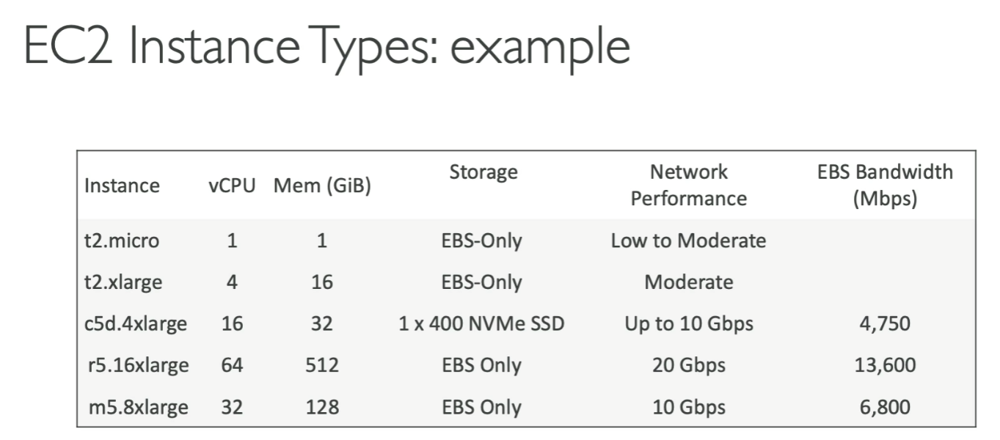

## Security Groups & Classic Ports Overview
* Overview
    * Securiy Groups are the fundamental of network security of AWS
    * They control how traffic is allowed into or out of our EC2 Instance
    * Security groups only contain **allow** rules
    * Security groups can reference by IP or by security group

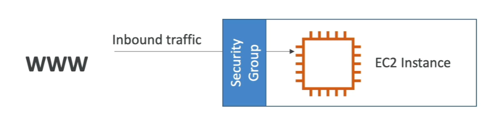

* Deep Dive
    * Security groups act as the **Firewall** on EC2 instsances
    * They regulate:
        * Access to ports
        * Authorized IP ranges - IPv4 and IPv6
        * Control of inbound network (from other to instance)

* Good to know
    * can be attached to multiple instances
    * Locked down to a region/VPC combination
    * Does live "outside" the EC2 - if traffic is blocked, the EC2 instance won't see it
    * **It's good to maintain one separate security group for SSH access**
    * If your application is not accessible (time out), then it's a security group issue
    * If your application gives a "connection refused" error, then it's an application error or it's not launched
    * All inbound traffic is **blocked** by default
    * All outbound traffic is **authorised** by default


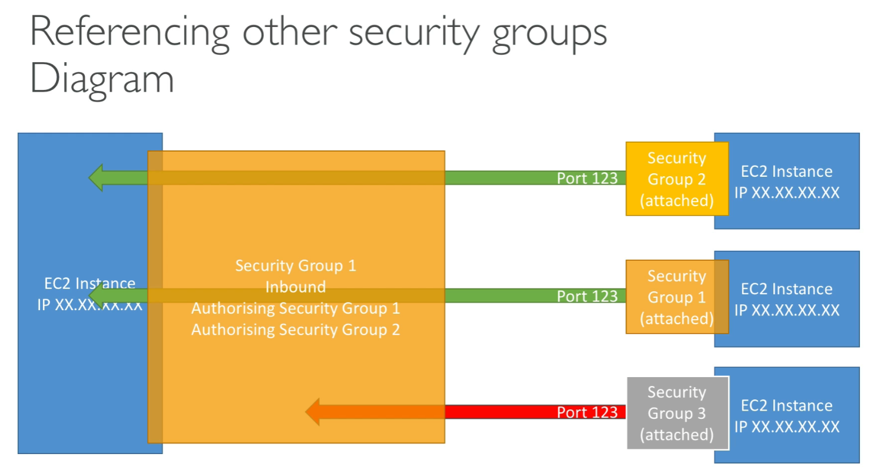
* can allow/not allow traffic based on Security Group; doesn't always have to be IP


* Classic ports to know
    * 22 = SSH (secure shell) - to log into a linux instance
    * 21 = FTP (File Transfer Protocol) - upload files to a file share
    * 22 = SFTP (Secure File Transfer Protocol) - upload files using ssh
    * 80 = HTTP - access unsecured websites
    * 443 = HTTPS - Access secured websites
    * 3389 = RDP (Remote Desktop Protocol) - log into a windows instance

## Hands On
* EC2 -> Network & Security -> Security Groups

## SSH Overview

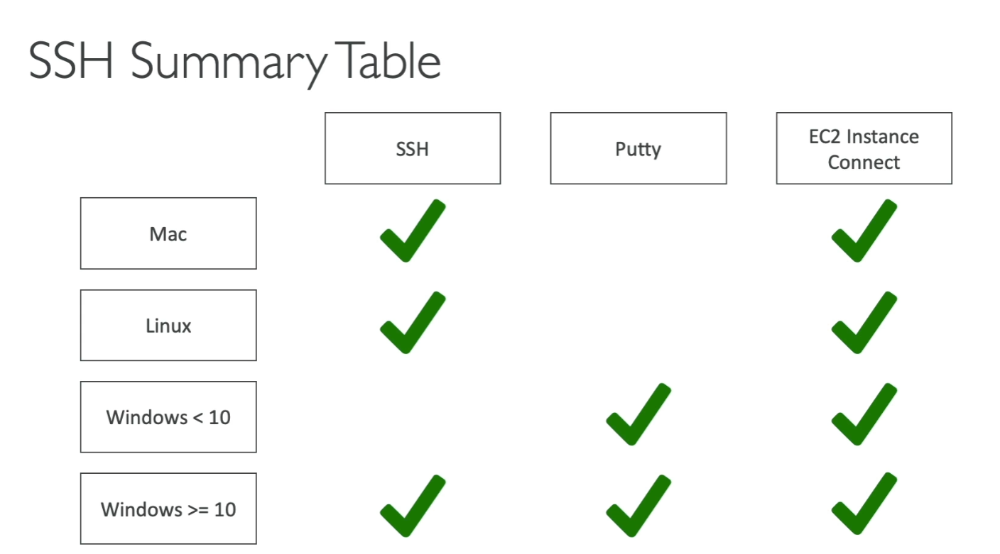
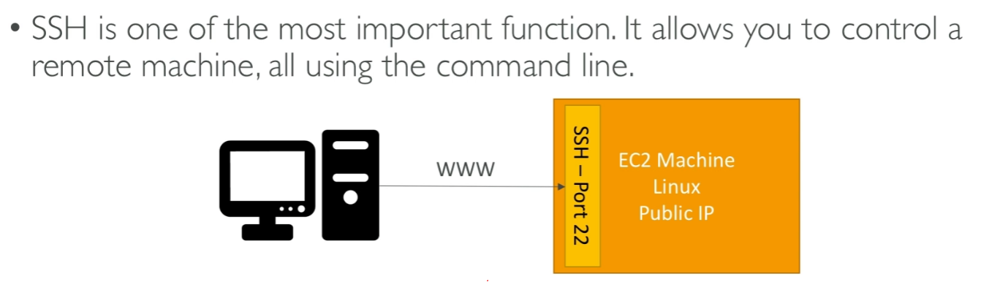

```
ssh -i <.pem file> <aws user name>@<ec2 public address>
```

* .pem file should be downloaded when you initially created the security groups for EC2 (during create EC2 process)

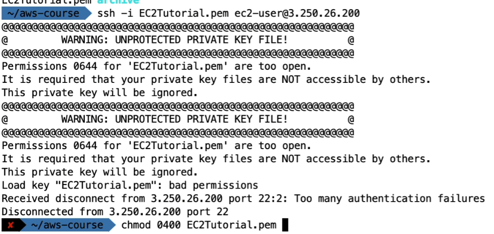

* if you get the above error, then `chmod 0400 <.pem file>`


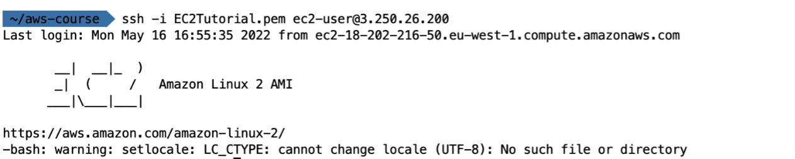

* you should get above screen

## EC2 Instance Connect

* Go to your EC2 instance -> Connect
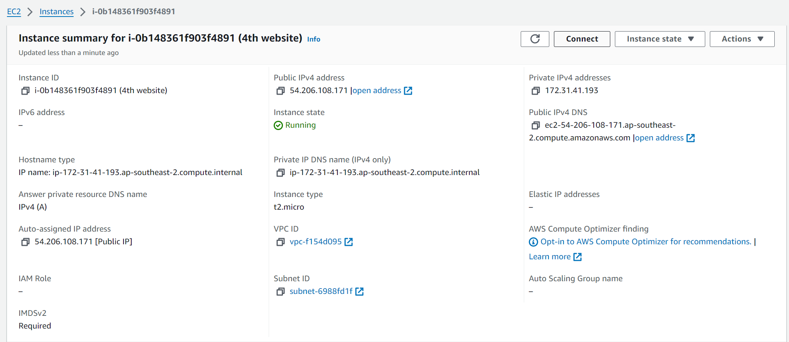

* It should look like this:
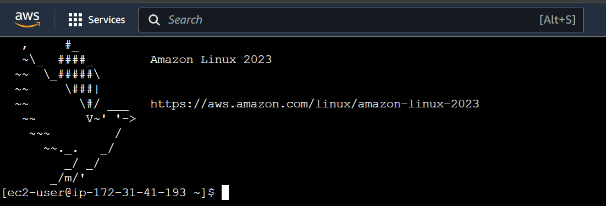

* sometimes you might need to open inbound connection for ssh for BOTH ipv4 and ipv6

## EC2 Instance Roles

* If you need to run aws-related commands in EC2, **DO NOT** enter access key in EC2 (because anyone with access to your EC2 will see this)
    * Instead, use EC2 IAM Roles
        * https://www.udemy.com/course/aws-certified-developer-associate-dva-c01/learn/lecture/26100908#overview

## EC2 Instance Purchasing Options

* On-Demand Instances - short workload, predictable pricing, pay by second
* Reserved (1 & 3 years)
    * Reserved Instances - long workloads
    * Convertible Reserved Instances - long workloads with flexible instances
* Savings Plan (1 & 3 years) - commitment to an amount of usage, long workload
* Spot Instances - short workloads, cheap, can lose instances (less reliable)

* Dedicated Hosts - book an entire physical server, control instance placement
* Dedicated Instances - no other customers will share your hardware
* Capacity Reservations - reserve capacity in a specific AZ for any duration

### EC2 On Demand

* Pay for what you use
* Has the highest cost but no upfront payment
* No long-term commitment
* Recommanded for short term and un-interrupted workloads, where you can't predict how the application will behave

### EC2 Reserved Instances

* Up to **72%** discount compared to On-Demand
* You reserve a specific instance attribues (Instance Type, Region, Tenancy, OS)
* Reservation Period - 1 year (+discount) or 3 years (+++discount)
* Payment Options - No Upfront (+), Partial Upfront (++), All Upfront(+++)
* Reserved Instance's Scope - Regional or Zonal (reserve capcity in an AZ)
* Recommended for steady-state usage applications (think database)
* You can buy and sell in the Reserved Instance Marketplace

### Convertible Reserved Instance
* Same as EC2 Reserved Instance, but instead, can change the EC2 instnace type instance family, OS, scope and tenancy
* Slightly less discount than EC2 Reserved Instance

## EC2 Savings Plan
* Get a discount based on long-term usage (up to 72%, same as RI)
* Commit to a certain type of usage ($10/hour for 1 or 3 years)
* Usage beyond EC2 Savings Plans is billed at the On-Demand price

* Locked to a specific instance family and AWS region
* Flexible across: 
    * Instnace Size
    * OS 
    * Tenancy

## EC2 Spot Instances

* Can get a discount of up to 90% compared to On-Demand
* Instances that you can "lose" at any point of time if the current spot price is more than your self-defined max price
* The MOST cost-efficietn instances in AWS
* Useful for workloads that are resilient to failure
    * Batch Jobs
    * Data Analysis
    * Image processing
    * Any distributed workloads
    * Workloads with a flexible start and end time
* Not suitable for critical jobs or databases

## EC2 Dedicated Hosts

* A physical server with EC2 instance capacity fully dedicated to your use
* Allows you address **compliance requirements** and **use your existing server-boudn software licenses** (per-socket, per-core, per-VM software license)
* Purchasing Options:
    * On-Demand - pay per second for active Dedicated Host
    * Reserved - 1 or 3 years (No Upfront, Partial Upfront, All Upfront)
* The most expensive

* Useful for software that have complicated licensing model (BYOL - bring your own license)
* Or for companies that have strong regulatory or compliance needs

## EC2 Dedicated Instances
* Instances run on hardware that's dedicated to you
* May share hardware with other instances in same account
* No control over instance placement (can move hardware after Stop/Start)

### EC2 Dedicated Host vs Dedicated Instance

* \# of instances per dedicated server
    * Dedicated Instance - means that the dedicated instance is the only resource on teh server.
    * Dedicated Host - in comparison, you can choose to multiple EC2 instances on the same server
 * Access to hardware level resource
    * dedicated instance - cannot
    * dedicated host - can

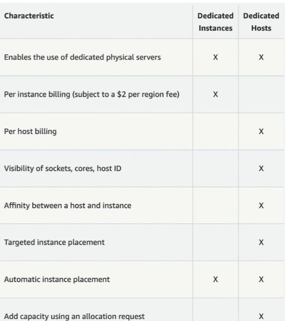

## EC2 Capacity Reservations
* Reserve On-Demand instances capacity in a specific AZ for any duration
* You always have access to EC2 capacity when you need it
* No time commitment (create/cancel anytime), no billing discounts
* Combine wiht Regional Reserved Instances and Savings Plans to benefit from billing discounts
* Charged at On-Demand rate whether you run instances or not
*  suitable for short-term, uninterrupted workloads that needs to be in a specific AZ
* Capacity Reservations mitigate against the risk of being unable to get On-Demand capacity in case there are capacity constraints.

## Overview
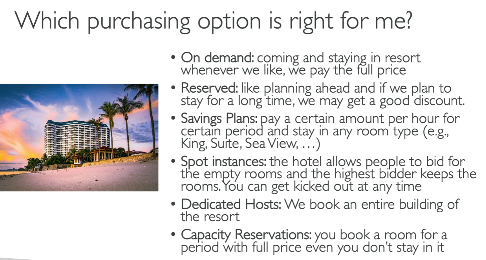

