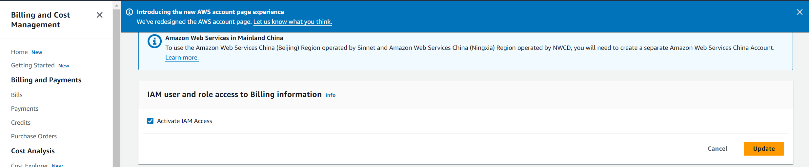
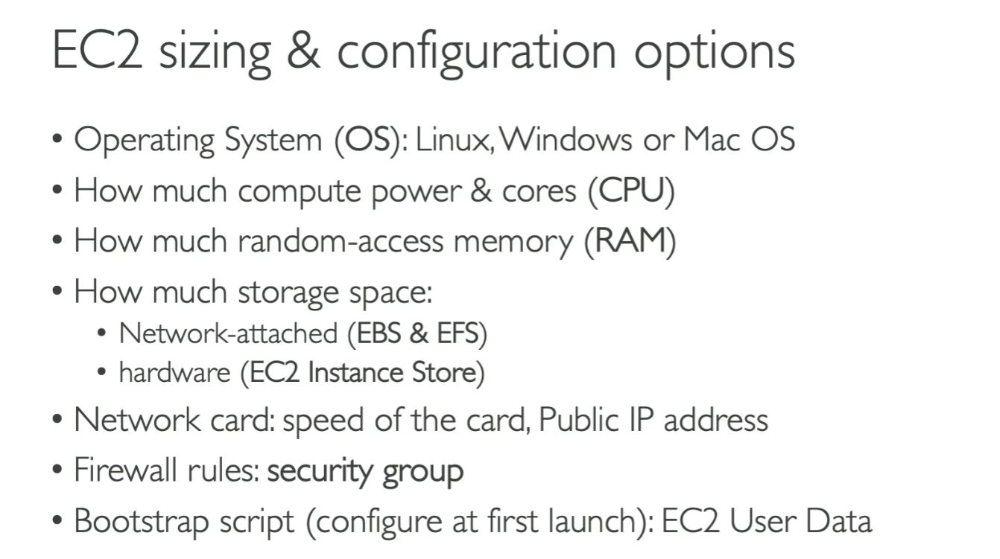
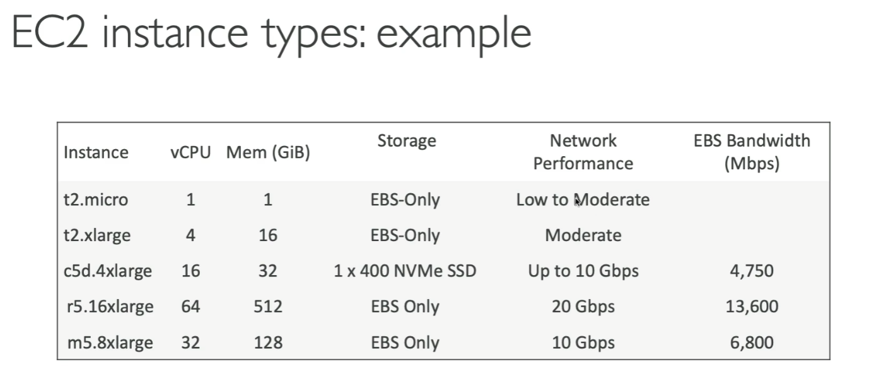

# EC2 Fundamentals

## AWS Budget Setup

* Top right (user) -> Billing and Cost Management
* By default, your normal (non-root user) account won't have permissions for "Billing and Cost Management". To fix this:
    * In your root user account: Top right (user) -> Accounts -> Billing and Payments -> IAM and role access to Billing Information -> "Activate IAM access"

## Set up Budget

* In Billing page, "Budgets and Planning" -> Budgets -> "Create a Budget" -> "zero spend budget" -> create budget

## EC2 Basics

### EC2 User Data
* It is possible to bootstrap our instances using an EC2 User Data script
* Bootstrapping means launching commands when a machine starts
* The script is only run once at the instance first start
* EC2 user data is used to automate boot tasks, such as:
    * installing updates
    * installing software
    * downloading common files from the internet
    * anything you can think of
* The EC2 User Data Script runs with the root user

### EC2 Instance types

