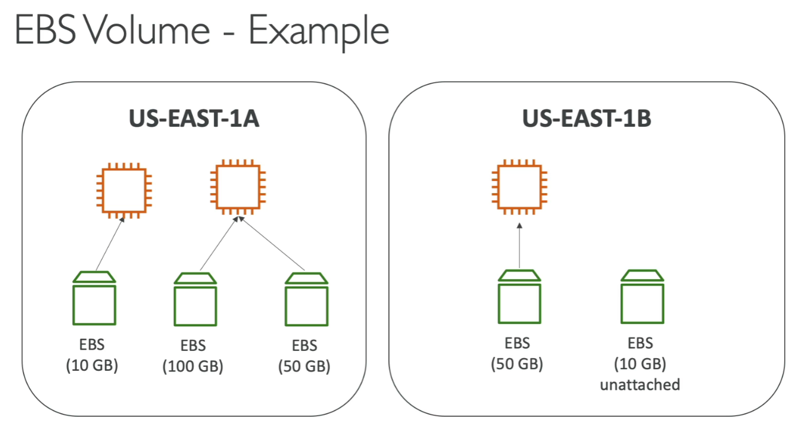
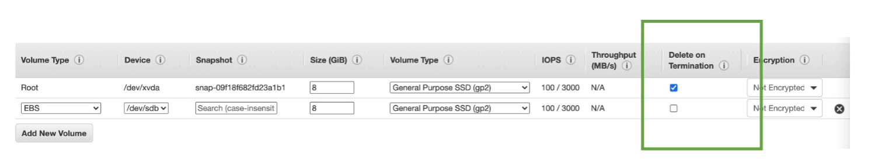
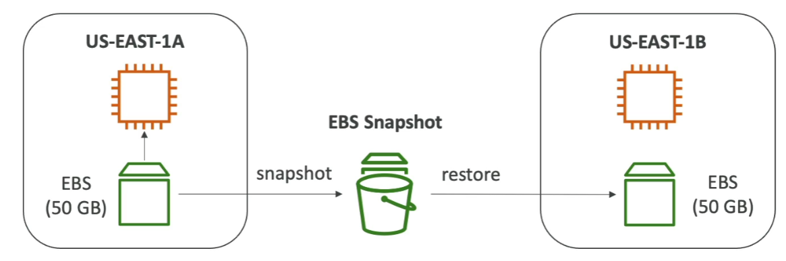
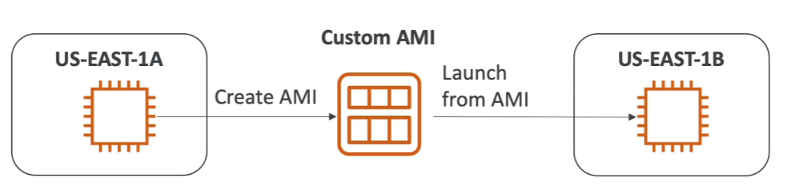

# EBS

## Overview
* An EBS (Elastic Block Store) Volume is a network drive you can attach to your instances while they run
* It allows your instances to persist data, even after their termination
* They can only be mounted to one instance at a time (at the CCP level)
* They are bound to a specific Availability zone

* *Anology: Think of them as "network USB stick"* (since you can remove from 1 EC2 and attach to another EC2)

## Deep Dive

* It's a **Network Drive** (ie. not a physical drive)
    * It uses the network to communicate the instance, which mean there might a bit of latency
    * It can be detached from an EC2 instance and attached to another one quickly
* It's locked to an **Availability Zone (AZ)**
    * An EBS volume in us-east-1a cannot be attached to another AZ
    * To move a volume across, you first need to snapshot it
* Have a provisioned capacity (size in GBS, and IOPS)
    * You get billed for all the provisioned capacity
    * You can increase the capacity of the drive overtime

## EBS - Delete on Termination attribute

* Controls the EBS behavior when an EC2 instance terminates
    * by default, the root EBS volume is deleted (attribute enabled)
    * by default, any other attached EBS volume is not deleted (attribute disabled)
* This can be controlled by the AWS console/AWS CLI
* Use case: preserve root volume when an instance is terminated

## EBS Snapshots
* Make a backup (snapshot) of your EBS volume at a point in time
* Not necessary to detach volume to do snapshot, but recommended
* Can copy snapshots across AZ or region

* Features
    * EBS Snapshot Archive
        * Move a snapshot to an "archive tier" that is 75% cheaper
        * Takes within 24 to 72 hours for restoring the archive
    * Recycle Bin for EBS Snapshots
        * Setup rules to retain deleted snapshots so you can recover them after an accidental deletion
        * Specify retention (from 1 day to 1 year)
    * Fast Snapshot Restore (FSR)
        * Force full initiazation of snapshot to have no latency on the first use 
        * Costly ($$$)
        * Useful if your snapshot is big

## AMI

* AMI = Amazon Machine Image
* AMI are a **customization** of an EC2 instance
    * You add your own software, configuration, operation system, monitoring...
    * Faster boot/configuration time because all your software is pre-packaged
* AMI are built for a specific region (and can be copied across regions)
* You can launch EC2 instances from:
    * A public AMI: AWS provided
    * Your own AMI: you make and maintain them yourself
    * An AWS Marketplace AMI: an AMI someone else made (and potentially sells)

### Workflow

1. Start an EC2 instance and customize it
2. Stop the instance (for data integrity)
3. Build an AMI - this will also create EBS snapshots
4. Launch instances from other AMIs

## EC2 Instance Store

* EBS volumes are network drives with good but "limited" performance
* If you need a high-performance hardware disk, use EC2 instance store

* Better I/O Performance
* EC2 Instance Store lose their storage if they're stopped (ephemeral)
* Good for buffer/cache/scratch data/temporary content (not good for long-term storage)
* Risk of data loss if hardware fails

* Backups and Replication are your responsibility

## EBS Volume Types

* 6 types
    * gp2/gp3 (SSD): 
        * General purpose SSD volume that balances price and performance for a wide variety of workloads
    * io1/io2 Block Express (SSD):
        * Highest-performance SSD volume for mission-critical low-latency or high-throughput workloads
    * st1 (HDD): 
        * Low cost HDD volume designed for frequently accessed, thoughput-intensive workloads
    * sc1 (HDD):
        * Lowest HDD volume designed for less frequently accessed workloads

* EBS volumes are charactered in:
    * *Size*
    * *Throughput* 
    * *IOPS* 

* When in doubt, always consult AWS documentation
* Only gp2/gp3 and io1/io2 block express can be used as boot volumes (where OS is running)

### Use case (per type)
* General Purpose SSD
    * Cost effective, low latency
    * System Boot volumes, VM, Development and Test environments
    * 1GiB - 16TiB
    * gp3
        * baseline of 3000 IOPS and throughput of 125MiB/s
    * gp2 
        * small gp2 volumes can burst IOPS 3000
        * Size of volume and IOPS are linked; max IOPS is 16,000
        * 3IOPS per GB

* Provisioned IOPS (PIOPS) SSD
    * Critical business applications with sustained IOPS performance
    * Or, applications that need more than 16,000 IOPS
    * Great for **Database** workloads (sensitive to storage perf and consistency)
    * io1 (4GiB - 16TiB):
        * Can increase PIOPS independently from storage size
    * io2 block express (4GiB - 64TiB)
        * sub-millisecond latency
        * Max PIOPS: 256,000 with an IOPS:GiB Ratio of 1000:1
    * Supports EBS Multi-Attach
* Hard Disk Drives (HDD)
    * Cannot be a boot volume
    * 125GiB to 16TiB
    * Throughput Optimized HDD (st1)
        * Big Data, Data Warehouses, Log Processing
        * Max throughput 500MiB/s - max IOPS 500
    * Cold HDD (sc1):
        * For data that is infrequently accessed
        * Scenarios where lower cost is important
        * Max throughput 250 MiB/s - max IOPS 250

## EC2 Multi-Attach - io2/io2 family

* Attach the same EBS volume to multiple EC2 instances in the same AZ
* Each instance has full read & write permissions to the high-performance volume
* Use case:
    * achieve higher application availability in clustered Linux Applications (Ex: Teradata)
    * applications must manage concurrent write operations
* Up to 16 EC2 instances at a time
* must use a file system that's cluster-aware (not XFS, EXT4, etc...)