# AWS Fundamentals: ELB + ASG

## Scalability

* Scalability means that an application/system can handle greater loads by adapting
* There are 2 kinds of Scalability:
    * vertical scalability
    * horizontal scalability
* Scalability is linked but different to High Availability

### Vertical Scalability
* Increasing the size of the instance
* For example: t2.micro -> t2.large
* is very common for non-distributed systems, such as databases
* RDS, ElastiCache are services that can scale vertically
* There's usually a limit on how much you can vertically scale (hardware limit)

### Horizontal Scalability
* increasing the number of instances/systems for your application
* implies distributed systems
* very common for web application/modern applications
* easy to horizontally scale thanks the cloud offerings, such as Amazon EC2

## High Availability

* High Availability usually goes hand in hand with horizontal sacling
* High availability means running your application/system in at least 2 data centers (== AZs)
* The goal of high availability is to **survive a data center loss**

## ELB (Elastic Load Balancing)
* Load balances are services that forward traffic to multiple servers (eg. EC2 instances) down stream
* Expose a single point of access (DNS) to your application
* Seamlessly handel failures of downstream instances
* Do a regular health checks to your instances
* Provide SLL termination (HTTPS) for your websites
* Enforce stickiness wiht cookies
* Separate public traffic from private traffic
* High availaiblity across zones

### Health Checks
* Health Checks are crucial for load balancers
* They enable the load balancer to know if instances it forwards traffic to are available to reply to requests
* The health check is done on a port and a route (/health is common)

### Types of load balancers on AWS
* Classic Load Balancer
* Application Load Balancer
* Network Load Balancer
* Gateway Load Balancer

## Application Load Balancer (ALB)

* Application Load balancers is Layer 7 (HTTP)
* Load balancing to multiple HTTP applications across machines (target groups)
* Load balancing to mutltiple applications on the same machine (ex: containers)
* Support for HTTP/2 and WebSocket
* Support redirects (from HTTP to HTTPS for example)

* Routing tables to different **target groups**
    * Routing based on path in URL (example.com/users vs example.com/posts)
    * Routing based on hostname in URL 
    * Routing based on Query String, Headers

* ALB are a great fit for microservices & container-based application (eg. Docker & Amazon ECS)
* Has a port mapping feature to redirect to a dynamic port in ECS
* In comparison, we'd need multiple classic load balancer per application

### What are Target Groups?
* EC2 Instances (can be managed by an auto scaling group) - HTTP
* ECS tasks (managed by ECS) - HTTP
* Lambda Functions - HTTP request is translated into a JSON event
* IP Addresses - must be private IPs
* ALB can route to multiple target groups
* Health Checks are at the target group level

### Query String Routing Example
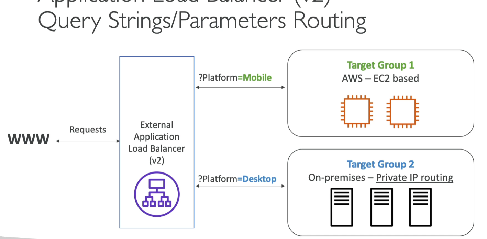

### Good to Know
* You get a Fixed hostname (XXX.region.elb.amazonaws.com)
* The application servers don't see the IP of the client directly
    * the true IP fo the client is inserted in the header **X-Forwarded-for**
    * We can also get Port (X-Forwarded-Port) and proto (X-Forwarded-Proto)

## Network Load Balancer (NLB)
* Is Layer 4
* Allows you to Forward TCP and UDP traffic to your instances
* Handle millions of request per seconds
* Less latency ~100ms (vs 400ms for ALB)

* NLB has *one static IP per AZ*, and supports assigning Elastic IP (helpful for whitelisting specific IP)
* NLB are used for extreme performance, TCP or UDP traffic
* Not included in AWS Free Tier

* Target Groups
    * EC2 instances
    * IP addresses - must be private IP
    * Application Load Balancer
    * Health Checks support the **TCP, HTTP and HTTPS Protocols**

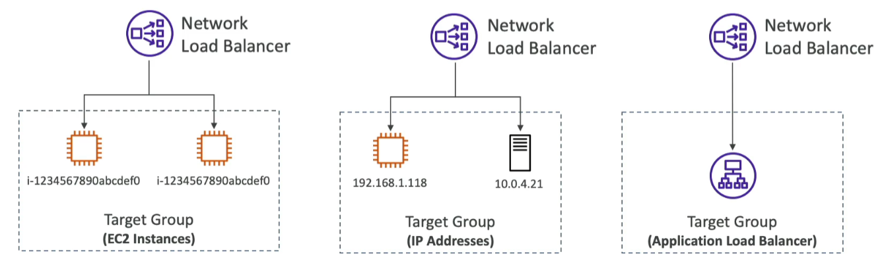

## Gateway Load Balancer (GWLB)

* Deploy, Scale and manage fleet of 3rd party network virtual appliances in AWS
* Example: Firewalls, Instrusion Detection and Prevention Systems, Deep Packet Inspection, payload manipulation

* In below example, you can route all your traffic to some "3rd party security virtual appliances" for security checks.etc. Afterwards, you can route the traffic back to the "Application (destination)". For your destination, the "3rd party..." is basically transparent.
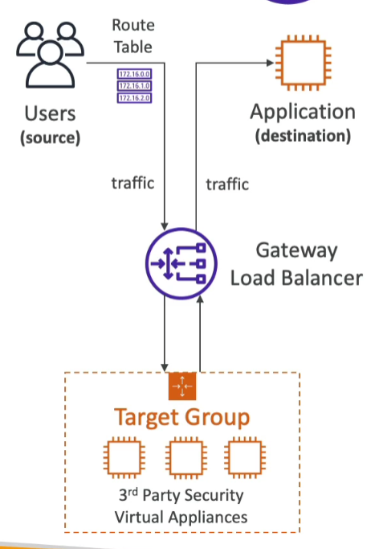

* Operates at Layer 3 (network layer) - IP Packets
* Combines the following functions:
    * Transparent Network Gateway - single entry/exit for all traffic
    * Load Balancer - distributes traffic to your virtual appliances
* Uses the GENEVE protocol or port 6081

* Target Groups
    * EC2 Instances
    * IP Addresses - must be private IPs

## Elastic Load Balancer - Stick Sessions (Session Affinity)
* It is possible to implement stickiness so that the same client is always redirected to the same instance behind a load balancer
* This works for Classic Load Balancer, Application Load Balancer and Network Load Balancer
* The 'cookie' used for stickiness has an expiration date you control
* Use case: make sure the user doesn't lose his session

* Cookie types
    * Application-based Cookies
        * Custom cookie
            * Generated by the target
            * Can include any custom attributes required by the application
            * Cookie name must be specified individually for each target group
            * Don't use AWSALB, AWSALBAPP, or AWSALBTG (reserved for use by the ELB)
        * Application Cookie
            * Generated by the load balancer
            * Cookie name is AWSALBAPP
    * Duration-based Cookies
        * Cookie generated by the load balancer
        * Cookie name is AWSALB for ALB, AWSELB for CLB

## Elastic Load Balancer - Cross-Zone Load Balancing

* Each load balancer instance distributes evenly across **ALL registered instances in ALL AZ**
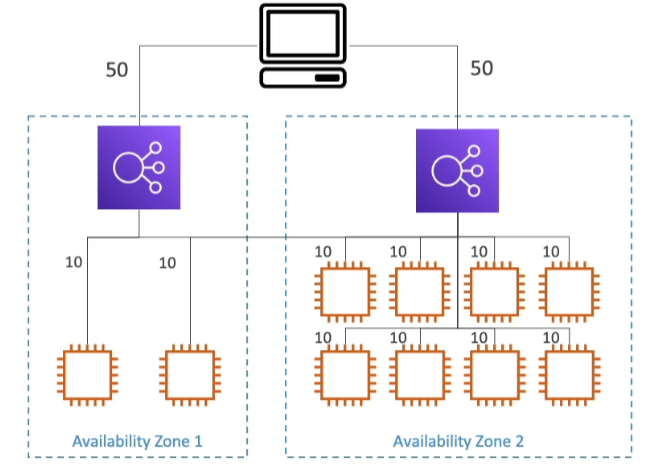
* In image above, 10% of load will be directed all of the EC2 instances despite them being located in different AZ, and under a different load balancer

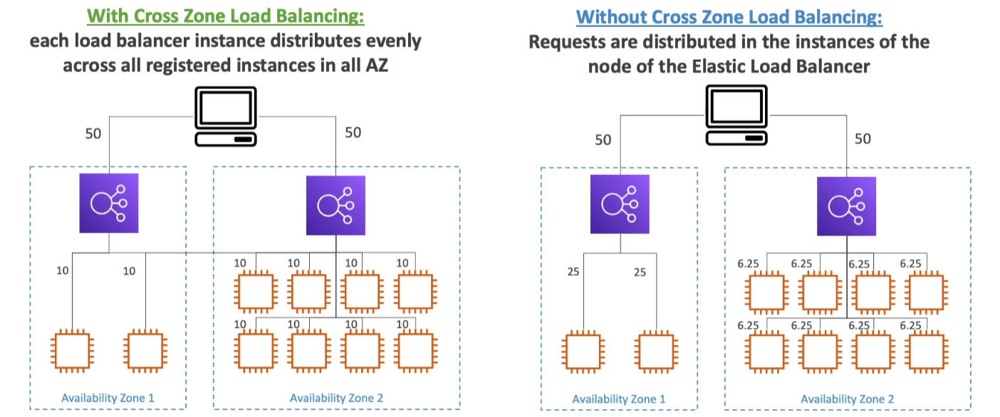
* As shown above, "without" cross zone load balancing will NOT distribute evenly across all EC2 instances. As a result, EC2 in AZ1 will get 25% of the load, but EC2 in AZ2 will only get 6.25% of the load each.

* Types
    * Application Load Balancer
        * Enabled by default (can be disabled at the Target Group Level)
        * No charges for inter-AZ data (usually in AWS, if data goes across AZ, you have to pay some money)
    * Network Load Balancer & Gateway Load Balancer
        * Cross Zone disabled by default
        * You pay charges ($) for inter AZ data if enabled
    * Classic Load Balancer
        * Disabled by default, but no charge if enabled

## Elastic Load Balancer - SSL/TLS

### Basics

* An SSL Certificate allows traffic between your clients and your load balancer to be encrypted in transit (in-flight encryption)
* SSL refers to Secure Sockets Layer, used to encrypt connections
* TLS refers to Transport Layer Security, which is a newer version
* Nowadays, TLS certificates are mainly used, but people still refer as SSL

* Public SSL Certificates are issued by Certificate Authorities (CA)
    * Commondo, Symantic, GoDaddy.etc
* SSL Certificates have an expiration date (you set) and must be renewed!

### SSL Certificates
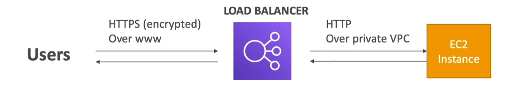

* The load balancer uses an X.509 Certificate (SSL/TLS server certificate)
* You can manage certificates using ACM (AWS Certificate Manager)
* You can create upload your own certificates alternatively
* HTTPS Listener:
    * you must specify a default certificate
    * you can add an optional list of certs to support multiple domains
    * Clients can use SNI (Server Name Indication) to specify the hostname they reach
    * Ability to specify a security policy to support older versions of SSL/TLS (legacy clients)

### Server Name Indication (SNI)
* solves the problem of **Loading multiple SSL certificates into one web server** (to server multiple websites)
* it's a "newer" protocol and requires the client to indicate the hostname of the target server in the initial SSL handshake
* the server will then find the correct certificate, or return the default one
* note:
    * only works for ALB & NLB (newer generation), cloud front
    * does not work for CLB (older gen)

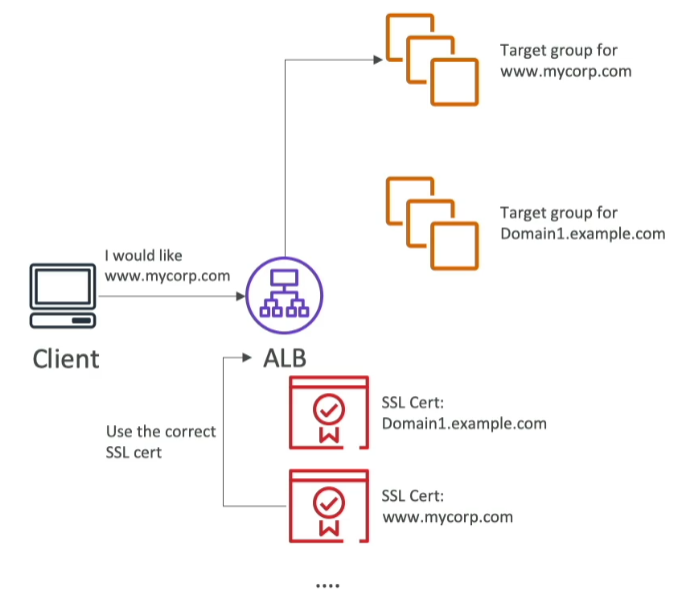

### Elastic Load Balancers - SSL Certificates

* Classic Load Balancer 
    * Support only **ONE** SSL certificate
    * must use multiple CLB for multiple hostname with multiple SSL certificates
* Application Load Balancer (V2), Network Load Balancer (V2)
    * supports multiple listeners with multiple SSL certificates
    * Uses SNI to make it work

## Connection Draining

* Feature Naming
    * If you are using CLB, it's called "Connection Draining"
    * If you are using ALB & NLB, it's called "Deregistration Delay"
* Time to complete "in-flight requests" while the instance is de-registrating or unhealthy
* Stops sending new requests to the EC2 instance which is de-registering
* Between 1 to 3600 seconds (Default: 300 seconds)
* Can be disabled (set value to 0)
* set to a low value if your requests are short

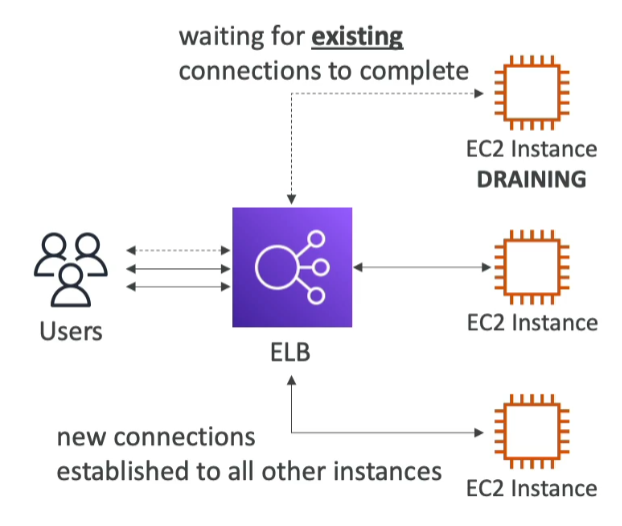

## Auto Scaling Groups (ASG)

* In real-life, the load on your websites and applications can change
* IN the cloud, you can create and get rid of servers very quickly
* the goal of an Auto scaling group (ASG) is to:
    * Scale out (add EC2 instances) to match an increased load
    * Scale in (remove EC2 instances) to match a decreased load
    * Ensure we have a minimum and a maximum number of EC2 instances running
    * Automatically register new instances to load balancer
    * Re-create an EC2 instance in case a previous one is terminated (ex: if unhealthy)
* ASG are free (you only pay for the underlying EC2 instances)

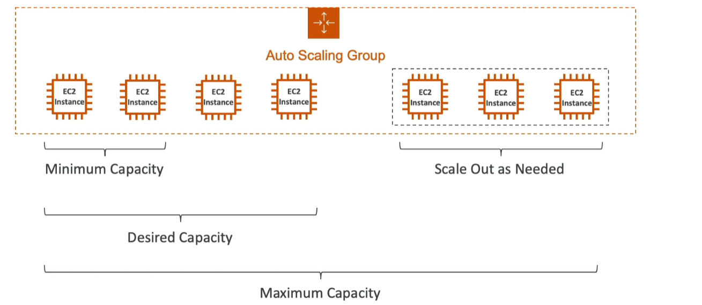

### Attributes
* A **Launch Template** 
    * including:
        * AMI + Instance type
        * EC2 User Data
        * EBS Volumes
        * Security Group
        * SSH Key Pair
        * IAM Roles for your EC2 Instances
        * Network + Subnet information
        * Load Balancer information
* Min/Max/Initial Capacity
* Scaling Policies

### CloudWatch Alarms & Scaling
* it is possible to scale an ASG based on CloudWatch Alarms
* an alarm monitors a metric (such as Average CPU, or a custom metric)
* Metrics such as Average CPU are computed for the overall ASG instances
* based on the alarm:
    * we can create scale-out policies (increase the number of instances)
    * we can create scale-in policies (decrease the number of instances)

## Auto Scaling Groups - Scaling Policies

* Dynamic Scaling 
    * Target Tracking Scaling
        * simple to set-up
        * example: i want the average ASG CPU to stay at around 40%
    * Simple/Step Scaling
        * When a cloudwatch alarm is triggered (example: CPU > 70%), then add 2 units
        * when a cloudwatch alarm is triggered (example: CPU < 30%), then remove 1 unit 
* Scheduled Scaling
    * Anticipate a scaling based on known usage patterns
    * Example: increase the min capacity to 10 at 5pm on Fridays
* Predictive Scaling
    * continuously forecast load and schedule scaling ahead 

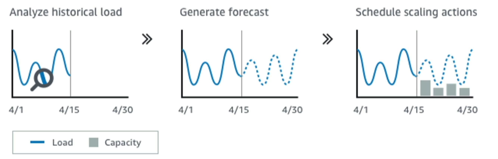

### Good metrics to scale on
* CPU Utilization: average CPU utilization across your instances
* Request Cound Per Target: to make sure the number of requests per EC2 instances is stable
* Average Network in/out (if your application is network bound)
* Any custom metric (that you push using CloudWatch)

### Scaling Cool Downs
* After a scaling activity happens, you are in the **cooldown period** (default 300 seconds)
* During the cooldown period, the ASG will not launch or terminate additional instances (to allow for metrics to stabilize)
* Advice: use a ready-to-use AMI To reduce configuration time in order to be serving requests faster and reduce the cooldown period

## Instance Refresh

* Goal: update launch template and then re-creating all EC2 instances
* For this, we can use the native feature of instance refresh
* Setting of minimum healthy percentage (this defines how many instances are be deleted over time; so you don't have too little instances at any point in time)
* Specify a warn-up time (how long until instance is ready to use)

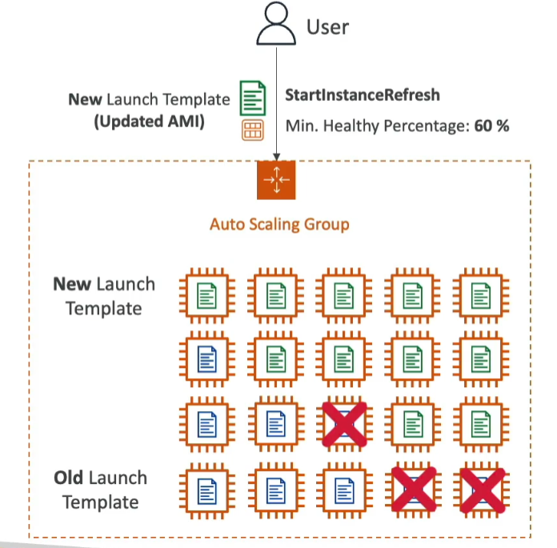