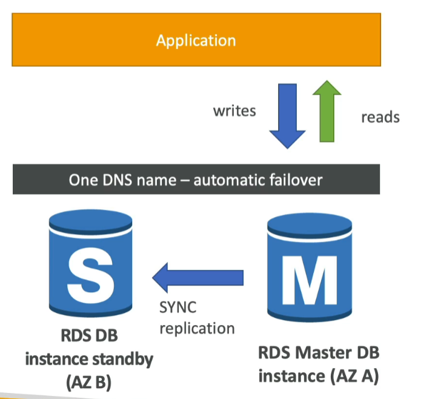

# RDS

* Stands for **Relational Database Service**
* a managed DB service for DB use SQL as a query language
* allows you to create databases in the cloud that are managed by AWS
    * Postgres
    * MySQL
    * MariaDB
    * Oracle
    * Microsoft SQL Server
    * IBM DB2
    * Aurora (AWS Proprietary Database)

## Advantage over using RDS versus deploying DB on EC2

* RDS is a managed service
    * automated provisioning, OS patching
    * Continuous backups and restore to specific time stamp (point in time restore)
    * Monitoring dashboards
    * read replicas for improved read performance
    * multi AZ setup for DR (disaster recovery) 
    * maintenance window for upgrades
    * scaling capacity (vertical and horizontal)
    * storage backed by EBS (gp2 or io1)
* BUT you can't SSH into your (EC2) instances

## Storage Auto Scaling

* Helps you increase storage on your RDS DB instance dynamically
* When RDS detects you are running out of free database storage, it scales automatically
* Avoid manually scaling your database storage
* You have to set **Maximum Storage Threshold** (maximum limit for DB storage)
* Automatically modify storage if:
    * Free storage is less than 10% of allocated storage
    * Low-storage lasts at least 5 minutes
    * 6 hours have passed since last modification
* Useful for applications with unpredictable workloads
* Supports all RDS database engines

## Read Replicas vs Multi AZ

### Read Replicas for read scalability

* Up to 15 read replicas
* within AZ, Cross AZ or Cross Region
* Replication is ASYNC, so reads are eventually consistent
* replicas can be promoted to their own DB
* applications must update the connection string to leverage read replicas

### Use Cases
* You have a product database that is taking on normal load
* You want to run a reporting application to run some analytics; but that would affect/slow down your production application
* Therefore, you create a read replica to run the new workload there.
* The production application is unaffected
* Read replicas are used for **SELECT** only kind of statements (not INSERT, DELETE, UPDATE)

#### Network Cost
* In AWS, there's a network cost when data goes from AZ to another (usually; but managed services sometimes don't follow this rule, and RDS is managed service)
* For RDS Read Replicas within the **same region**, you don't pay that fee

### Multi AZ (Disaster Recovery)
* SYNC replication (when write to masterA, it'll be synchronized to masterB)
* One DNS name - automatic app failover to standby 
* increase availability
* Failover in case of loss of AZ, loss of network, instance or storage failure
* No manual intervention in apps (if apps cannot connect, it'll auto-failover)
* not used for scaling (just for disaster recovery)
* **Note** The read replicas can be setup as multi-az for disaster recovery (DR)

### From Single-AZ to Multi-AZ

* Zero downtime operation (no need to stop the DB)
* Just click on "modify" for the database
* The following happens internally:
    * A snapshot is taken
    * A new DB is restored from the snapshot in a new AZ
    * Synchronization is established between the two databases

## Amazon Aurora

* proprietary technology from AWS
* Postgres and MySQL are both supported as Aurora DB
* Aurora is "AWS Cloud optimized" and claims 5x performance improvement over MySQL on RDS, over 3x performance of Presgres on RDS
* Aurora storage automatically grows in increments of 10GB, up to 128TB
* Aurora can have up to 15 replicas and the replication process is faster than MySQL (sub 10ms replica lag)
* Failover in Aurora is instantaneous, it's HA native
* Aurora costs more than RDS (20% more) - but it is more efficient

### High Availability and Read Scaling
* 6 copies of your data across 3 AZ
    * you only need:
        * 4 copies out of 6 needed for writes
        * 3 copies out of 6 needed for reads
        * self healing with peer-to-peer replication
        * storage is triped across 100s of volumes
* one instance takes write (master)
* automated failover for master in less than 30 seconds
* Master + up to 15 read replicas serve reads
    * if master fails, any of the read replicas can become the master (which is different from how RDS works)

* support for cross region replication

### DB Cluster
* Shared Storage
* Read Replicas can be **auto-scaling**, but keeping track of all the IPs will be difficult, thus, there's something called **Reader Endpoint** which servers as a load balancer

### Features
* automatic fail-over
* backup and recovery
* isolation and security
* industry compliance
* push-button scaling
* automated patching with zero downtime
* advanced monitoring
* routine maintenance
* backtrack: restore data at any point in time without using backups

## RDS & Aurora Security

* At-rest encryption
    * Database master & replicas encryption using AWS KMS - must be defined at launch time
    * if the master is not encrypted, the read replicas cannot be encrypted
    * to encrypt an un-encrypted database, go through a DB snapshot & restore as encrypted
* In-flight encryption
    * TLS-ready by default, use the AWS TLS root certificates client-side
* IAM authentication
    * IAM roles to connect to your database (instead of your username/pw)
* Security Groups
    * Control Network access to your RDS/aurora DB
* No SSH available except on RDS custom
* Audit Logs can be enabled and sent to CloudWatch Logs for longer retension

## Amazon RDS Proxy
* Fully managed database proxy for RDS
* Allows apps to pool and share DB connections established with the database
* Improving database efficiency by reducing the stress on database resources (eg. CPU, RAM) and minimize open connections (and timeouts)
* Serverless, autoscaling, highly available (multi-AZ)
* Reduced RDS & Aurora failover time by up to 66%
* Supports RDS (MySQL, Postgres.etc) and Aurora
* No code change reuqired for most apps
* Enforce IAM Authentication for DB, and securely store credentials in AWS Secret Manager
* RDS Proxy is never publicly accessible (must be accessed from VPC)

